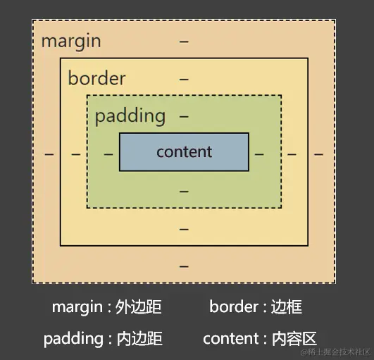

## element 语法

1. 生成标签，直接输入标签名，按 tab 键即可
2. 如果想要生成多个相同标签，加上`*`即可。如`div*3`就可以快速生成 3 个 div
3. 如果有**父子**关系的标签，可以用`>`。如`ul > li`
4. 如果有**兄弟**关系的标签，用`+`即可。如`div+p`
5. 如果生成带有类名或 id 的， 直接输入`.demo`或者`#two` ，按 tab 键即可
6. 如果生成的`div`类名是有顺序的，可以用自增符号`$ `。如`.name$*3`
7. 如果想要在生成的标签内部写内容可以用`{}`表示

## CSS 引入方式

- 内嵌式（内联样式）

  - 只作用于当前页面，没有实现结构与样式分离

  ```css
  <style>
    h1 {
      color: red;
      font-size: 40px;
    }
  </style>
  ```

- 外链式（外链样式）

  - 作用于多个页面，最常用，需要使用 link 标签引入外部的 css 文件

  ```html
  <link rel="stylesheet" href="CSS路径" />
  ```

- 行内式（行内样式）

  - 作用于当前标签，不建议使用

  ```html
  <标签名 style="属性1：属性值1; 属性2：属性值2;">内容</标签名>
  ```

## CSS 属性书写顺序

更多规范可以参考：[腾讯前端书写规范](https://link.juejin.cn/?target=https%3A%2F%2Falloyteam.github.io%2FCodeGuide%2F%23css-declaration-order)

1. **布局定位属性**
   1. display
   2. float、position
   3. clear
   4. visibility、overflow
2. **盒子模型 + 背景**
   1. width、height
   2. margin、padding、border
   3. background
3. **文本内容属性**
   1. color、font
   2. text-decoration
   3. text-align
   4. line-height
   5. white-space
4. **其他属性（修饰）**
   1. cursor
   2. border-radius
   3. text-shadow
   4. box-shadow

> 类选择器个数推荐不超过三个

## CSS 三大特性

- 层叠性：相同样式会覆盖

- 继承性：`text-` 、 `font-` 、`line-` 、 `color`属性（不影响布局的，大概率能够继承）

  > `vertical-align`不能继承

- 优先级：

  | **选择器**           | **选择器权重** |
  | -------------------- | -------------- |
  | 继承、`*`            | (0, 0, 0, 0)   |
  | 元素选择器           | (0, 0, 0, 1)   |
  | 类选择器，伪类选择器 | (0, 0, 1, 0)   |
  | ID 选择器            | (0, 1, 0, 0)   |
  | 行内样式             | (1, 0, 0, 0)   |
  | `!important`         | 无穷大         |

  > 如果都是继承，则会直接继承父级标签或者最近的祖先标签


## CSS 选择器

### 基础选择器

- 标签选择器（0 0 0 1）

```css
p {
  /* CSS属性和值 */
}
```

- 类选择器（0 0 1 0）

```css
.s1 {
  /* CSS属性和值 */
}
```

- ID 选择器（0 1 0 0）

```css
#s1 {
  /* CSS属性和值 */
}
```

- 通配符选择器（0 0 0 0）

```css
* {
  /* CSS属性和值 */
}
```

> `!important` > 行内样式 > ID 选择器 > 类选择器 | 属性选择器 > 标签 > 通配符 > 继承 > 浏览器默认属性

| 基本选择器 | 特点                                                    | 用法                     |
| ---------- | ------------------------------------------------------- | ------------------------ |
| 通配选择器 | 选中所有标签， 一般用于清除样式                         | `* { color: red }`       |
| 元素选择器 | 选中所有同种标签，但是不能差异化选择                    | `h1 { color: red }`      |
| 类选择器   | 选中所有特定类名 (class) 的元素。用的最多，使用频率很高 | `.say { color: red }`    |
| ID 选择器  | 选中特定 id 值的那个元素 (ID 唯一)                      | `#earthy { color: red }` |

### 复合选择器

#### 基本复合选择器

- 后代选择器：`元素1 元素2`

```css
ul li {
  color: red;
}
```

- 子代选择器：`元素1>元素2`

```css
/* 选中指定元素中，符合要求的子元素 */
div > a {
  color: red;
}
```

- 相邻兄弟选择器：`元素1+元素2`

```css
/* 选中指定元素后，符合条件的相邻兄弟元素 */
div + p {
  color: red;
}
```

> 所谓相邻，就是**紧挨着**他的下一个

- 通用兄弟选择器：`选择器1~选择器2`

```css
/* 选中指定元素后，符合条件的 所有 兄弟元素 */
div ~ p {
  color: red;
}
/* 这里选择的是div后的全部兄弟p标签 */
```

- 并集选择器：`元素1, 元素2`

```css
#high,
.rich,
.beauty {
  font-size: 40px;
  background-color: skyblue;
  width: 200px;
}
```

> 并集选择器优先级是单独计算的

- 交集选择器：`元素1元素2`

```css
p.beauty {
  color: blue;
}
```

#### 属性选择器

选中属性值符合一定要求的元素

语法：

- `[属性名]`： 选中**具有**某个属性的元素
- `[属性名="值"]`：选中包含某个属性，且属性值**等于**指定值的元素
- `[属性名^="值"]`：选中包含某个属性，且属性值以指定的值**开头**的元素
- `[属性名$="值"]`：选中包含某个属性，且属性值以指定的值**结尾**的元素
- `[属性名*="值"]`：选择包含某个属性，属性值**包含**指定值的元素

```css
/* 选中具有title属性的元素 */
div[title] {
  color: red;
}

/* 选中title属性值为content的元素 */
div[title="content"] {
  color: red;
}

/* 选中title属性值以a开头的元素 */
div[title^="a"] {
  color: red;
}

/* 选中title属性值以u结尾的元素 */
div[title$="u"] {
  color: red;
}

/* 选中title属性值包含g的元素 */
div[title*="g"] {
  color: red;
}
```

#### 伪类选择器

伪类用于当已有元素处于的某个状态时，为其添加对应的样式，这个状态是根据用户行为而动态变化的

比如说，当用户悬停在指定的元素时，我们可以通过`:hover`来描述这个元素的状态。虽然它和普通的`css`类相似，可以为已有的元素添加样式，但是它只有处于`dom`树无法描述的状态下才能为元素添加样式，所以将其称为伪类

##### 状态性伪类

基于元素当前状态进行选择的。在与用户的交互过程中元素的状态是动态变化的，因此该元素会根据其状态呈现不同的样式。当元素处于某状态时会呈现该样式，而进入另一状态后，该样式也会失去

- `:link` 应用于未被访问过的链接
- `:hover` 应用于鼠标悬停到的元素
- `:active` 应用于被激活的元素
- `:visited` 应用于被访问过的链接，与`:link`互斥
- `:focus` 应用于拥有键盘输入焦点的元素

##### 结构性伪类

`CSS3`新增选择器，利用`dom`树进行元素过滤，通过文档结构的互相关系来匹配元素，能够减少`class`和`id`属性的定义，使文档结构更简洁

- 所有兄弟元素中的第一个：`:first-child`
- 所有兄弟元素中的最后一个：`:last-child`
- 所有兄弟元素第 n 个：`:nth-child(n)`、倒数: `nth-last-child(n)`
- 所有**同类型**兄弟元素的第一个：`:first-of-type`
- 所有**同类型**兄弟元素的最后一个：`:last-of-type`
- 所有**同类型**兄弟元素的第 n 个：`:nth-of-type(n)`、倒数 ：`nth-last-of-type(n)`

> n 从 0 开始计算，因此`2n`、`even`为偶数、`2n+1`、`odd`为奇数、`-n+3`前三个、`n+5`从第五个开始到最后一个为止

除此之外，还有：

- 根元素：`:root`
- 空元素：`:empty`（空格也算内容）
- 否定伪类：`:not(选择器)`满足除括号内元素
- UI 伪类：
  - `:checked`被选中的复选框或单选按钮
  - `:enable`可用的表单元素（没有 disabled 属性）
  - `:disabled`不可用的表单元素（有 disabled 属性）

#### 伪元素选择器

用于创建一些不在文档树中的元素，并为其添加样式

实际上，伪元素就是选取某些元素前面或后面这种普通选择器无法完成的工作。控制的内容和元素是相同的，但它本身是基于元素的抽象，并不存在于文档结构中。比如，我们可以通过`::before`来在一个元素前增加一些文本，并为这些文本添加样式

> `CSS3`规范中要求使用单冒号`:`用于`CSS3`伪类，双冒号`::`用于 `CSS3`伪元素，目的是区分伪类和伪元素

- `::first-letter` 选择元素文本的第一个字
- `::first-line` 选择元素文本的第一行
- `::before` 在元素内容的最前面添加新内容
- `::after` 在元素内容的最后面添加新内容
- `::selection` 匹配用户被用户选中或者处于高亮状态的部分
- `::placeholder` 匹配占位符的文本，只有元素设置了`placeholder`属性时，该伪元素才能生效

## CSS 颜色

### 颜色名

直接使用颜色对应的英文单词，编写比较简单，例如：`red`、`green`、`blue`、`purple`、`orange`、`gray`

> 更多颜色名参考：[MDN-color](https://link.juejin.cn/?target=https%3A%2F%2Fdeveloper.mozilla.org%2Fzh-CN%2Fdocs%2FWeb%2FCSS%2Fnamed-color)

### rgb(a)

使用 **红、黄、蓝** 这三种光的三原色进行组合，这其实相当于一个调色盘，值大小对应颜色的浓度

- **r** 表示 **红色**
- **g** 表示 **绿色**
- **b** 表示 **蓝色**
- **a** 表示 **透明度**

```css
/* 使用 0~255 之间的数字表示一种颜色 */
color: rgb(255, 0, 0);/* 红色 */
color: rgb(0, 255, 0);/* 绿色 */
color: rgb(0, 0, 255);/* 蓝色 */
color: rgb(0, 0, 0);/* 黑色 */
color: rgb(255, 255, 255);/* 白色 */

/* 混合出任意一种颜色 */
color:rgb(138, 43, 226) /* 紫罗兰色 */
color:rgba(255, 0, 0, 0.5);/* 半透明的红色 */

/* 也可以使用百分比表示一种颜色（用的少） */
color: rgb(100%, 0%, 0%);/* 红色 */
color: rgba(100%, 0%, 0%,50%);/* 半透明的红色 */
```

**opacity 不透明度**

- `opacity`值为`0~1`的小数，0 为完全透明（整个元素）

> `opacity` 与 `rgba` 的区别？
>
> - opacity 是一个属性，设置的是**整个元素**（包括元素里的内容）的不透明度
> - rgba 是颜色的设置方式，用于设置颜色，它的透明度，仅仅是**调整颜色的透明度**

### HEX(A)

HEX 的原理同与 rgb 一样，依然是通过：**红**、**绿**、**蓝** 进行组合（六位十六进制数）

格式为：`#rrggbb`（r，g，b 范围为`0~f`）

```css
color: #ff0000; /* 红色 */
color: #00ff00; /* 绿色 */
color: #0000ff; /* 蓝色 */
color: #000000; /* 黑色 */
color: #ffffff; /* 白色 */

/* 如果每种颜色的两位都是相同的，就可以简写*/
color: #ff0011; /* 可简为：#f01 */

/* 但要注意前三位简写了，那么透明度就也要简写 */
color: #ff112299; /* 可简为：#f129 */
```

### HSL(A)

HSL 是通过：色相、饱和度、亮度，来表示一个颜色的，格式为：`hsl(色相, 饱和度, 亮度)`

- 色相（H）：取值范围是 0~360 度，具体度数对应的颜色如下图：


- 饱和度（S）：取 0-100%，指色彩的纯度，越高色彩越纯，低则逐渐变灰
- 亮度（L）：取 0-100%，增加亮度，颜色会向白色变化；减少亮度，颜色会向黑色变化
- 透明度（A）：取值 0~1 之间， 代表透明度

## CSS 字体

- 字体系列：`font-family`。使用 `,` 来使其添加后备值

```css
div {
  font-family: "STCaiyun", "Microsoft YaHei", sans-serif;
}
```

- 字体大小：`font-size`
- 字体粗细：`font-weight`100~1000 数字越大字越粗，`100~300`等同于`lighter`，`400~500`等同于`normal`，`600`及以上等同于`bold`
- 字体样式：`font-style`（normal、italic、oblique）

字体属性复合写法：

- `font`：font-style font-weight font-size/line-height font-family

字体族必须是最后一位、字体大小必须是倒数第二位，且字体连写必须保留`size`和`family`这两个属性

## CSS 文本

- 文本颜色：`color`（重点）

```css
/*关键词:*/
background-color: pink;

/*rgb:*/
background-color: rgb(255, 255, 255);

/*rgba:*/
background-color: rgba(0, 0, 0, 0.5);

/*十六进制*/
background-color: #ff6700;
```

- 文本间距
  - 字母间距： `letter-spacing`
  - 单词间距： `word-spacing` （通过空格识别词）
  - 属性值为像素（ px ）正值让间距增大，负值让间距缩小
- 文本修饰：`text-decoration`
  - none（无装饰线，常用）、underline（下划线）、overline（上划线）、line-through（删除线）
- 对齐文本：`text-align`
  - 在 HTML 中，行内块元素、行内元素，会被当成文本处理，即可以使用`text-align`使其居中（给父元素设置）
  - left（左对齐）、center（居中对其）、right（右对齐）
- 文本缩进：`text-indent` （em 为当前文字倍数）
- 行间距（行高）：`line-height`


可选值：

- normal ：由浏览器根据文字大小决定的一个默认值
- 像素( px )
- 数字：参考自身 font-size 的倍数（常用）
- 百分比：参考自身 font-size 的百分比

```css
div {
  line-height: 60px;
  line-height: 1.5;
  line-height: 150%;
}
```

> line-height 和 height 关系
>
> - 设置了 height ，那么高度就是 height 的值
> - 不设置 height，会根据 line-height 计算高度

## CSS 背景

- 背景颜色：`background-color`：`transparent`（默认，无色透明）
- 背景图片：`background-image`：`none` | `url（url）`
  - `url` 值是指向外部资源（比如图片）的路径。根据 CSS 规范，`url` 值可以选择性地使用引号
  - `url("路径")`、`url(路径)`
  - 大多数情况都可以省略引号。只有在特殊情况下，比如路径中包含 **某些特殊字符**， 或者路径中包含空格，才需要使用引号来确保路径的正确解析（无论你选择是否使用引号，都不会影响样式的正确解析和渲染。只需确保指定的路径是正确的，并根据需要选择是否使用引号来提高代码的可读性和清晰度）
- 背景图片大小：`background-size`
  - 数字：width height
  - 百分比
  - contain：1 : 1 会让图片与盒子一致；非比例关系会留白
  - cover：1 : 1 会让图片与盒子一致；非比例关系仍会拉满，图片变形
- 背景平铺：`background-repeat`：`repeat`（重复平铺）| `no-repeat`| `repeat-x` | `repeat-y`（垂直重复）
- 背景图位置：`background-position`
  - 水平：left、center、right
  - 垂直：top、center、bottom
  - 取单值则另一个值默认为 center

> 更多值参考：[MDN-background-position](https://link.juejin.cn/?target=https%3A%2F%2Fdeveloper.mozilla.org%2Fzh-CN%2Fdocs%2FWeb%2FCSS%2Fbackground-position)

- 背景附着：`background-attachment`：`scroll` | `fixed`（固定）

- 复合写法：没有固定顺序，但大小必须写到位置后面

  ```css
  /*建议前四个连写，size独写*/
  background: color image repeat position/size;
  ```

- 背景颜色半透明：`background：rgba（0,0,0,0.3）`盒子背景半透明

## CSS 盒子模型

### 盒子组成

CSS 会把所有的 HTML 元素都看成一个**盒子**，所有的样式也都是基于这个盒子

- margin（外边距）：盒子与外界的距离
- border（边框）：盒子的边框
- padding（内边距）：紧贴内容的补白区域
- content（内容）：元素中的文本或后代元素都是它的内容

图示如下：



> 外边距`margin`不会影响盒子的大小，但会影响盒子的位置

盒子类型属性：`box-sizing`

- `content-box`（默认值）盒子大小：`border + padding + content`

在 CSS 中，设置`box-sizing`为`content-box`时，`height`和`width`属性为`content`内容区大小

- border-box（IE 盒子模型）`height`和`width`属性设置的就是盒子的总大小（根据 padding 和 border 自动内减）

```
resize`属性可以控制是否允许用户调节元素尺寸。常见值有：`none、both、horizontal、vertical
```

### 盒子四大区域

#### content 内容

| CSS 属性名   | 功能                   | 属性值 |
| ------------ | ---------------------- | ------ |
| `width     ` | 设置内容区域宽度       | 长度   |
| `max-width ` | 设置内容区域的最大宽度 | 长度   |
| `min-width ` | 设置内容区域的最小宽度 | 长度   |
| `height    ` | 设置内容区域的高度     | 长度   |
| `max-height` | 设置内容区域的最大高度 | 长度   |
| `min-height` | 设置内容区域的最小高度 | 长度   |

#### border 边框

- `border`：border-width border-style border-color（无固定顺序）
- `border-style 值`：none、solid（实线）、dashed（虚线）、dotted（点线）

border 连写很多：`border-left-style`、`border-left-width`、`border-left-color`

```css
/*上边框*/
border-top: solid 1px red;
/*下边框*/
border-bottom: solid 1px red;
/*左边框*/
border-left: solid 1px red;
/*右边框*/
border-right: solid 1px red;
```

#### padding 内边距

`padding`的值不能为负数，行内元素`padding`垂直方向会有问题，不建议这么做

```css
/*上 右 下 左*/
padding: 10px;
/*上下  左右*/
padding: 20px 30px;
/*上  左右  下*/
padding: 20px 30px 40px;
/*上 右 下 左*/
padding: 20px 30px 40px 50px;
/*单方向设置*/
padding-top: 30px;
padding-bottom: 40px;
padding-left: 50px;
padding-right: 60px;
```

#### margin 外边距

marigin 用于盒子的移动（可以为负数）参考父元素的`content`计算

- 水平居中：margin：0 auto；
- 给行内元素设置上下 margin 无效
- 上 margin 、左 margin ：影响自己的位置；下 margin 、右 margin ：影响后面兄弟元素的位置

```css
/*上 右 下 左*/
margin: 10px;
/*上下  左右*/
margin: 20px 30px;
/*上  左右  下*/
margin: 20px 30px 40px;
/*上 右 下 左*/
margin: 20px 30px 40px 50px;
/*单方向设置*/
margin-top: 30px;
margin-bottom: 40px;
margin-left: 50px;
margin-right: 60px;
```

**margin 塌陷**：

- 互相嵌套的**块级元素**，第一个元素上 margin 作用在父元素上，最后一个元素下 margin 作用在父元素上
- 解决办法：
  - 给父元素设置`padding-top`或`border-top`
  - 给父元素设置`overflow: hidden;`
  - 把子元素转换为行内块 `display: inline-block;`
  - 浮动、绝对定位、相对定位的盒子不会有嵌套块级元素外边距塌陷现象

**margin 合并**：

- 垂直布局的**块级元素**上下 margin 会合并，最终合并为 margin 的最大值
- 解决办法：上下兄弟，只用设置一个外边距即可

### 布局技巧

- 行内元素、行内块元素可以被父元素当做**文本**处理

- 子元素水平居中：

  - 块级元素：margin：0 auto；
  - 行内块、行内元素：text-align: center;

- 子元素垂直居中：

  - 块元素：`margin-top`: (content - 子元素总高)/2

  - 行内、行内块：`height = line-height`&&`vertical-align:middle`

    （绝对垂直居中：font-size：0）

### 隐藏元素常见方式

- `display: none;`

真正隐藏元素，使用这个属性，被隐藏的元素不占据任何空间，这个元素的任何子元素也会同时被隐藏。`display: none;`会触发浏览器的重绘与回流

这种方式产生的效果就像元素完全不存在，但在`DOM`中依然可以访问到这个元素，也可以通过`DOM`来操作它

- `opacity: 0;`

只能从视觉上隐藏元素，而元素本身依然占据它自己的位置并对网页的布局起作用。此外还能响应用户交互，如响应用户点击事件

- `visibility: hidden;`

元素会隐藏，也会占据着自己的位置，并对网页的布局起作用。与`opacity`不同的是它不会响应任何用户交互，元素在读屏软件中也会被隐藏

如果对于子元素的`visibility`被设置为`visible`而父元素的`visibility`设置为`hidden`，子元素依旧可以显示而父元素会被隐藏

- `overflow: hidden;` + `postion`

使用`position`与`overflow`属性的意义就是把元素脱离文档流移出视觉区域，超出屏幕显示的部分隐藏掉

- `overflow: hidden;` + `height: 0 !important;`

使用`height: 0;`将元素高度设置为`0`，使用`overflow: hidden`将超出部分裁剪隐藏，即可实现隐藏效果

### CSS 常见问题拓展

- `margin-left: auto;`为什么可以使元素靠右？

  > The following constraints must hold among the used values of the other properties:
  >
  > `margin-left` + `border-left-width` + `padding-left`+ `width` + `padding-right` +`border-right-width` + `margin-right` = `width of containing block`
  >
  > 你的属于其中一种情况：
  >
  > If there is exactly one value specified as `auto`, its used value follows from the equality.

也就是在上述等式中，只有你设置的`margin-left: auto`，那么`margin-left`将会被设置为满足上述等式，而等式的右边是容器盒子宽度，等式中的其它值(除过`width`)都为 0，因此`margin-left = width of containing block - width(div)`

- `margin：0 auto;`为什么可以使元素居中？

  > If both `margin-left` and `margin-right`are `auto`, their used values are equal. This horizontally centers the element with respect to the edges of the containing block.

当 `margin-left` 和 `margin-right` 都为 `auto` 时，两者就会一样，从而使元素居中

## CSS 浮动

> 随着 flex、grid 等布局的兼容性越来越好，float 几乎已经不用了，了解即可

浮动语法：

```css
选择器 {
  float: none/left/right;
}
```

### 浮动特性

**文档流**：指的是盒子元素排版布局过程中，元素会自动从左往右，从上往下的流式排列

**文本流**：指的是文字元素排版布局过程中，元素会自动从左往右，从上往下的流式排列

> 浮动元素会脱离文档流但不会脱离文本流，当浮动时其不会影响周围的盒子模型，但是文字会环绕在浮动元素周围。可以认为文档流与文字流是分层结构而浮动元素盒子与文字元素处于同一层

重要特性：

- 不管浮动前是什么元素，浮动后：默认宽与高都是被内容撑开（尽可能小），而且可以设置宽高，顶部对其
- 浮动元素具有行内块的特性（设置宽高、不独占一行），但不会被当成文本处理，并且没有行内块的空白问题
- 浮动元素不会 margin 合并，也不会 margin 塌陷，能够完美的设置四个方向的 margin 和 padding
- 浮动的元素比标准流高半个级别，可以覆盖标准流的元素
- **浮动的元素会受到上面元素边界的影响**，且遵循同方向浮动原则：下一个浮动元素会在上一个浮动元素后面左右浮动
- 浮动**只会影响后面**的标准流，**不会影响前面**的标准流

使用浮动注意点：

- 浮动元素经常搭配标准流父级，先用标准流父级元素排列上下位置，之后内部子元素采取浮动排列左右位置
- 子浮父不浮、兄弟一起浮（**一浮全浮** ）

### 浮动影响

**对兄弟元素的影响：** 后面的兄弟元素，会占据浮动元素之前的位置，在浮动元素的下面；对前面的兄弟无影响

**对父元素的影响：** 不能撑起父元素的高度，导致父元素高度塌陷；但父元素的宽度依然束缚浮动的元素

### 清除浮动

- 清除浮动的原因：父级元素没有高度、子盒子浮动、影响后续布局

> 清除浮动，父级会根据浮动子盒子自动检测高度、**如果父级元素本身有高度，则不需要清除浮动**

语法：

```css
选择器 {
    clear：left/right/both；
}
```

清除浮动方法：

- 给父元素指定高度
- 使用额外标签

```html
<div class="parent">
  <div class="float-left">浮动元素1</div>
  <div class="float-left">浮动元素2</div>
  <div style="clear:both"></div>
</div>
```

- 父级添加 overflow 属性，设置属性为`hidden、auto、scroll`，本质上是开启元素 BFC
- 父级添加 after 伪元素：

```css
.clearfix::after {
  content: "";
  display: block;
  clear: both;

  /*后两项针对老浏览器*/
  height: 0;
  visibility: hidden;
}
```

- 父级添加双伪元素:

```css
.clearfix::after,
.clearfix::before {
  content: "";
  display: table;
}
.clearfix::after {
  clear: both;
}
/*双伪元素，其中before的主要作用是解决外边距塌陷问题，本质上after就已经够了*/
```

## CSS 定位

### 定位组成

- 定位：摆放盒子，按照定位的方式移动盒子。`定位 = 定位模式 + 边偏移`
- **定位元素**：设置**（绝对定位、固定定位）**后，不管之前是什么元素，一律为定位元素。**定位元素默认宽、高都被内容所撑开，且能自由设置宽高**

**定位模式**：`static(静态定位)、relative、absolute、fixed、sticky`

**边偏移**：`top、bottom、left、right`

### 五大定位方式

#### 静态定位

`static`属性是`HTML`元素的默认值，即没有定位，遵循正常的文档流对象，对于`top`、`bottom`、`left`、`right`、`z-index`属性的设置都被忽略

#### 相对定位

相对定位`position: relative`，元素的位置是相对其原本位置进行偏移，其不脱离文档流

设置偏移属性后会移动相对定位元素，但它原本所占的空间不会改变，相对定位元素经常被用来作为绝对定位元素的容器块

> 绝大多数情况下，相对定位，会与绝对定位配合使用（子绝父相）

#### 绝对定位

绝对定位`position: absolute`，元素的位置相对于最近的已定位父元素，如果元素没有已定位的父元素，那么它的位置相对于`<html>`。**绝对定位完全脱离文档流与文本流**，不占据文档空间

在网页定位中，绝对定位通常有两种用法：

- **子绝父相**：子元素绝对定位，父元素相对定位，让子元素相对于父元素进行移动。父元素是相对定位，对网页的布局影响比较小
- **子绝父绝**：遵循子绝父相的时，发现父元素有绝对定位，此时父元素里面的孩子直接子绝也可

#### 固定定位

固定定位`position: fixed`，元素的位置相对于浏览器窗口，为固定位置，即使是窗口滚动元素也不会移动。**固定定位完全脱离文档流与文本流**，不占据文档空间

在`<iframe>`中的元素使用`fixed`是相对于`<iframe>`进行定位的，`<iframe>`类似于在页面中创建了一个新的浏览器窗口

#### 黏性定位

粘性定位`position: sticky`，元素的位置基于用户的滚动位置来定位，粘性定位的元素是依赖于用户的滚动，在`position: relative`与`position: fixed`定位之间切换

- 在页面显示时`sticky`的表现类似于`position: relative`
- 当页面滚动超出目标区域时，`sticky`的表现类似于`position: fixed`，它会固定在目标位置

元素定位表现为在跨越特定阈值前为相对定位，之后为固定定位，这个特定阈值指的是`top`、`right`、`bottom`、`left`其中之一，必须通过指定`top`、`right`、`bottom`、`left`四个阈值其中之一，才可使粘性定位生效，否则其行为与相对定位相同

### 定位总结

| **定位模式**      | **是否脱离标准流** | **移动位置**        |
| ----------------- | ------------------ | ------------------- |
| static 静态定位   | 否（占有位置）     | 不能使用边偏移      |
| relative 相对定位 | 否（占有位置）     | 相对于自身位置移 动 |
| absolute 绝对定位 | 是（不占有位置）   | 带有定位的父级      |
| fixed 固定定位    | 是（不占有位置）   | 浏览器可视区        |
| sticky 粘性定位   | 否（占有位置）     | 浏览器可视区        |

### 定位层级

- `z-index`，用于元素设置显示层级
- 数值可以为：`正数、负数、0、auto`。数字越大盒子越靠上（默认为 auto）

```css
选择器 {
  z-index: 1;
}
```

- 不同布局方式元素的层级关系：标准流 < 浮动 < 定位
- **定位元素之间的层级关系相同**（相对定位、绝对定位、固定定位）

示例代码：

```html
<style>
  * {
    margin: 0;
    padding: 0;
    box-sizing: border-box;
  }

  div {
    width: 300px;
    height: 300px;
  }

  .red {
    /* 相对定位 */
    position: relative;
    left: 0;
    top: 0;
    z-index: 2;
    background-color: red;
  }

  .blue {
    /* 绝对定位 */
    position: absolute;
    left: 100px;
    top: 100px;
    z-index: 1;
    background-color: blue;
  }

  .green {
    /* 固定定位 */
    position: fixed;
    left: 200px;
    top: 200px;
    z-index: 9999;
    background-color: green;
  }
</style>
<body>
  <div class="blue"></div>
  <div class="green"></div>
  <div class="red"></div>
</body>
```

## CSS3 新特性

### 私有前缀

W3C 标准所提出的某个 CSS 特性，在被浏览器正式支持之前，浏览器厂商会根据浏览器的内核，使用私有前缀来测试该 CSS 特性，在浏览器正式支持该 CSS 特性后，就不需要私有前缀了

如下代码中的`-webkit-`就是私有前缀：

```css
div {
  width: 400px;
  height: 400px;
  -webkit-border-radius: 20px;
}
```

> 查询 CSS3 兼容性的网站：[caniuse.com/](https://link.juejin.cn/?target=https%3A%2F%2Fcaniuse.com%2F)

**常见浏览器私有前缀**

- Chrome **浏览器：** **-**webkit
- Safari **浏览器：** **-**webkit
- Firefox **浏览器：** -moz
- Edge **浏览器：** webkit

> 常用的 CSS3 新特性，主流浏览器都支持，无需添加前缀。如若不支持，可以通过插件来自动添加私有前缀

### 圆角边框

通过`border-radius`属性可以给任何元素制作圆角

- `border-radius`：四个边角`border-*-*-radius`属性的缩写。两个值（左上右下、右上左下）、三个值（左上、右上左下、右下）
- `border-top-left-radius`：定义左上角弧度
- `border-top-right-radius`：定义右上角弧度
- `border-bottom-right-radius`：定义右下角弧度
- `border-bottom-left-radius`：定义左下角的弧度

`border-radius`可以用于调整边框弧度，也可用于绘制图形

- 圆形

```css
.circle {
  width: 300px;
  height: 300px;
  background-color: #ffa500;
  border-radius: 50%; /* 默认为宽度的比例 */
}
```

- 矩形圆角

```css
.capsule {
  width: 200px;
  height: 60px;
  background-color: purple;
  /* 胶囊按钮  盒子高度的一半*/
  border-radius: 30px;
}
```

> 当`border-radius`的值超过元素最小边（即`height`或`width`的一半）时，进一步增加`border-radius`的值将不会产生更多的变化，因为圆角不能超过元素的一半

### 边框外轮廓

`outline-width`：外轮廓的宽度

`outline-color`：外轮廓的颜色

`outline-style`：外轮廓的风格

- none：无轮廓
- dotted：点状轮廓
- dashed：虚线轮廓
- solid：实线轮廓
- double：双线轮廓

`outline-offset`：设置外轮廓与边框的距离，正负值均可（独立属性）

`outline`复合属性：width、color、style

### 盒阴影

**盒子阴影不占用空间**。阴影可以叠加，使用逗号隔开

- `box-shadow`: h-shadow v-shadow blur spread color inset;
- 不能主动添加属性值 outset（默认值）否则会报错

| **值**     | **描述**                                       |
| ---------- | ---------------------------------------------- |
| `h-shadow` | **必需**。水平阴影的位置，允许负值             |
| `v-shadow` | **必需**。垂直阴影的位置，允许负值             |
| `blur    ` | 可选。模糊距离，只能正值（深、浅）             |
| `spread  ` | 可选。阴影的尺寸（大、小）                     |
| `color   ` | 可选。阴影的颜色                               |
| `inset   ` | 可选。将外部阴影(outset)改为内部阴影（不常用） |

### 新增文本属性

#### 文本阴影

- `text-shadow`： h-shadow v-shadow blur color;
- 阴影可以叠加，使用逗号隔开
- 属性值为 0 时，要带单位 px

| **值**     | **描述**                           |
| ---------- | ---------------------------------- |
| `h-shadow` | 必需。水平阴影的位置，允许负值     |
| `v-shadow` | 必需。垂直阴影的位置，允许负值     |
| `blur    ` | 可选。模糊距离，只能正值（深、浅） |
| `color   ` | 可选。阴影的颜色                   |

#### 文本换行

在 CSS3 中，我们可以使用`white-space`属性设置文本换行方式

常用属性值如下：

| 值         | 含义                                                                         |
| ---------- | ---------------------------------------------------------------------------- |
| `normal  ` | 文本超出边界自动换行，文本中的换行被浏览器识别为一个空格（默认值）           |
| `pre     ` | 原样输出，与 pre 标签的效果相同                                              |
| `pre-wrap` | 在 pre 效果的基础上，超出元素边界自动换行                                    |
| `pre-lin ` | 在 pre 效果的基础上，超出元素边界自动换行，且只识别文本中的换行，空格 会忽略 |
| `nowrap  ` | 强制不换行                                                                   |

#### 文本溢出

在 CSS3 中，我们可以使用`text-overflow`属性设置文本内容溢出时的呈现模式

常用属性值如下：

| 值          | 含义                                          |
| ----------- | --------------------------------------------- |
| `clip     ` | 当内联内容溢出时，将溢出部分裁切掉（默认值）  |
| `ellipsis ` | 当内联内容溢出块容器时，将溢出部分替换为`...` |

> 要使`text-overflow`属性生效，块容器必须显式定义 overflow 为非 visible 值， white-space 为 nowrap 值

#### 文本修饰

CSS3 升级了 text-decoration 属性，让其变成了复合属性

```css
text-decoration: text-decoration-line || text-decoration-style ||
  text-decoration-color;
```

子属性含义：

- ```
  text-decoration-line
  ```

  （设置文本装饰线的位置）

  - none：指定文字无装饰 （默认值）
  - underline：指定文字的装饰是下划线
  - overline：指定文字的装饰是上划线
  - line-through：指定文字的装饰是贯穿线

- ```
  text-decoration-style
  ```

  （文本装饰线条的形状）

  - solid：实线 （默认）
  - double：双线
  - dotted：点状线条
  - dashed：虚线
  - wavy：波浪线

- `text-decoration-color`（文本装饰线条的颜色）

### 字体新增

可以通过`@font-face`指定字体的具体地址，浏览器会自动下载该字体，无需依赖用户电脑上的字体

- `font-family`: 必需，规定字体的名称
- `src`: 必需，定义字体文件的`URL`
- `font-stretch`: 可选，定义如何拉伸字体，默认是`normal`
- `font-style`: 可选，定义字体的样式，默认是`normal`
- `font-weight`: 可选，定义字体的粗细，默认是`normal`
- `unicode-range`: 可选，定义字体支持的`UNICODE`字符范围，默认是`U+0-10FFFF`

```css
@font-face {
  font-family: "情书字体";
  src: url("./方正手迹.ttf");
}
```

> 字体图标用法同上。不同字体图标用法也不同，以对应官网为准

### 渐变

`CSS3`渐变可以在两个或多个指定的颜色之间显示平稳的过渡，渐变值一般由 UI 提供，前端程序员了解即可

渐变主要分为：

- `Linear Gradients`：[线性渐变](https://link.juejin.cn/?target=https%3A%2F%2Fdeveloper.mozilla.org%2Fzh-CN%2Fdocs%2FWeb%2FCSS%2Fgradient%2Flinear-gradient)，向下/向上/向左/向右/对角方向
- `Radial Gradients`：[径向渐变](https://link.juejin.cn/?target=https%3A%2F%2Fdeveloper.mozilla.org%2Fzh-CN%2Fdocs%2FWeb%2FCSS%2Fgradient%2Fradial-gradient)，由中心定义

#### 线性渐变

线性渐变语法：

```css
/* 渐变轴为 45 度，从蓝色渐变到红色 */
linear-gradient(45deg, blue, red);

/* 从右下到左上、从蓝色渐变到红色 */
linear-gradient(to left top, blue, red);

/* 色标：从下到上，从蓝色开始渐变，到高度 40% 位置是绿色渐变开始，最后以红色结束 */
linear-gradient(0deg, blue, green 40%, red);

/* 颜色提示：从左到右的渐变，由红色开始，沿着渐变长度到 10% 的位置，然后在剩余的 90% 长度中变成蓝色 */
linear-gradient(.25turn, red, 10%, blue);

/* 多位置色标：45% 倾斜的渐变，左下半部分为红色，右下半部分为蓝色，中间有一条硬线，在这里渐变由红色转变为蓝色 */
linear-gradient(45deg, red 0 50%, blue 50% 100%);
```

使用示例：

- 多个颜色渐变， 默认**从上到下**渐变


```css
background-image: linear-gradient(red, yellow, green);
```

- **关键词**、**角度**设置线性渐变的方向


```css
background-image: linear-gradient(to right top, red, yellow, green);
background-image: linear-gradient(30deg, red, yellow, green);
```

- 调整开始**渐变的位置**


```css
background-image: linear-gradient(red 50px, yellow 100px, green 150px);
```

#### 径向渐变

径向渐变语法：

```css
/* 在容器中心的渐变，从红色开始，变成蓝色，最后变成绿色 */
radial-gradient(circle at center, red 0, blue, green 100%) /* 值可以为 circle、ellipse */
```

使用示例：

- 多个颜色之间的渐变， 默认从圆心四散


```css
background-image: radial-gradient(red, yellow, green);
```

- 使用**关键词**、**像素值**调整渐变圆的圆心位置


```css
background-image: radial-gradient(at right top, red, yellow, green);
background-image: radial-gradient(at 300px 0px, red, yellow, green);
```

- 调整渐变形状为正圆


```css
background-image: radial-gradient(circle, red, yellow, green);
```

- 调整形状的半径


```css
background-image: radial-gradient(100px, red, yellow, green);
background-image: radial-gradient(50px 100px, red, yellow, green);
```

- 调整开始渐变的位置


```css
background-image: radial-gradient(red 50px, yellow 100px, green 150px);
```

#### 重复渐变

无论线性渐变，还是径向渐变，在没有发生渐变的位置，继续进行渐变，就为重复渐变

- 使用`repeating-linear-gradient`进行重复线性渐变，具体参数同`linear-gradient`
- 使用`repeating-radial-gradient`进行重复径向渐变，具体参数同`radial-gradient`

### 滤镜

`CSS3`的`filter`属性可支持对于网页进行各种滤镜效果，[官网滤镜用法示例](https://link.juejin.cn/?target=https%3A%2F%2Fdeveloper.mozilla.org%2Fzh-CN%2Fdocs%2FWeb%2FCSS%2Ffilter)

```
filter: none | blur() | brightness() | contrast() | drop-shadow() | grayscale() | hue-rotate() | invert() | opacity() | saturate() | sepia() | url();
```

### 平面转换 2D

二维坐标系：


#### 平面位移

使用`transform`属性实现元素的位移（translate）、旋转（rotate）、缩放（scale）等效果

- 位移语法`translate`：

```css
/* 元素移动到坐标轴的哪个位置 */
transform: translate(x, y); /* 单个值时，默认为x方向 */
transform: translateX(); /* 值或百分比，百分比参考自身宽度 */
transform: translateY(); /* 值或百分比，百分比参考自身高度 */
```

> margin 与 translate 的区别？
>
> - margin 百分比值参考父元素的宽度，**translate 参考元素自身**
> - margin 移动时会影响其他元素位置，translate 不会影响其他元素，且未脱离标准流（有相对定位的特点）

#### 平面旋转

- `rotate`：设置旋转角度，指定角度值`deg`或`turn`，正顺负逆
- `rotate`要与`transition`配合使用才能看到效果

```css
transform: rotate(1turn); /* 1turn为一圈 */
```

#### 平面缩放

使用`scale`改变元素的尺寸

```css
transform: scale(x轴缩放倍数, y轴缩放倍数);
```

注意点：

- 缩放只是一种视觉效果，不会影响其他盒子
- `scale`值大于 1 为放大，小于 1 为缩小
- **缩放可以取负值，先缩小再放大**
- 若`scale`只设一个值，则表示 x 和 y 轴等比例缩放

#### 倾斜

使用`skew`使元素倾斜（扭曲），参数值为角度值（了解即可）

```css
/* 正值（整体左斜）斜边在右 */
/* 负值（整体右斜）斜边在左 */
transform: skew(angle);
/* 多个值 */
transform: skew (ax,ay);
skewX(ax);
skewY(ay);
```

> 官网参考：[MDN-skew 用法](https://link.juejin.cn/?target=https%3A%2F%2Fdeveloper.mozilla.org%2Fzh-CN%2Fdocs%2FWeb%2FCSS%2Ftransform-function%2Fskew)

#### 多重变换

使用`transform`复合属性实现多形态变换。**多重变换时建议最后旋转**

```css
transform: translate() rotate(); /* 先位移后旋转 */
```

> 旋转会改变网页元素的坐标轴向。先写旋转，则后面的转换效果的轴向以旋转后的轴向为准，会影响转换效果（坐标轴改变）

#### 变换原点

元素变换时，默认的**原点**是元素的中心，使用`transform-origin`可以设置变换的原点

```css
transform-origin: 原点水平位置 原点垂直位置;
```

- 修改变换原点对位移没有影响， 对旋转和缩放会产生影响
- 如果提供两个值，第一个用于横坐标，第二个用于纵坐标
- 如果只提供一个，若是像素值，表示横坐标，纵坐标取 50% ；若是关键词，则另一个坐标取 50%

取值：

- 方位名词（`left`、`top`、`right`、`bottom`、`center`）
- 像素单位数值，**以左上角为零点**
- 百分比（相对于自身）

### 空间转换 3D

> 空间转换一般不用 CSS 实现，仅供学习了解

使用`transform`属性实现元素在空间内的位移、旋转、缩放等效果

- x 、y 和 z 三条坐标轴构成了一个立体空间，z 轴位置与视线方向相同
- 空间转换也叫 3D 转换


#### 立体呈现

元素进行 3D 变换的首要操作：**父元素**开启 3D 空间

- 使用

  ```
  transform-style
  ```

  属性

  - `flat`：使子元素位于此元素的二维平面内（默认值）
  - `preserve-3d`：使得子元素位于此元素的三维空间内

- 空间内，转换元素都有自己独立的坐标轴，互不干扰

#### 透视

使用`perspective`实现透视效果，添加给开启 3D 变换的父元素

- 取值：像素单位，数值在 800-1200（推荐取值）不可以为负数，值越小则越近
- 透视距离也称为视距，所谓的视距就是人的眼睛到屏幕的距离
- 透视不是 3D 效果，其作用是在空间变换时，为元素添加近大远小、近实远虚的视觉效果


透视点位置可通过`perspective-origin`属性来调整（一般不调整）默认的透视点在元素的中心

#### 空间位移

空间位移是在平面位移的基础上，可以让元素沿 z 轴位移

```css
transform: translate3d(x, y, z); /* 值或百分比，百分比参考自身宽度 */
transform: translateX(x);
transform: translateY(y);
transform: translateZ(z);
```

#### 空间旋转

空间旋转是在平面旋转的基础上，可以让元素沿 x 轴和 y 轴旋转

```css
/*Z轴，正值是顺时针旋转*/
transform: rotateZ(az);

/*X轴，正值是沿着X轴正方向从外到内旋转*/
transform: rotateX(ax);

/*Y轴，正值是沿着Y轴正方向从左到右*/
transform: rotateY(ay);
```

- 左手法则：左手握住旋转轴，拇指指向正值方向，手指弯曲方向为旋转正值方向


- 合并写法：`transform:rotate3d(x,y,z,角度);`用来自定义旋转轴位置以及角度

```css
transform: rotate3d(1, 1, 1, 30deg); /* x、y、z 分别旋转30 度 */
```

#### 空间缩放

空间缩放是在平面缩放的基础上，可以让元素沿 z 轴缩放

```css
transform: scaleX(倍数); /* 值为数字 */
transform: scaleY(倍数);
transform: scaleZ(倍数);
transform: scale3d(x, y, z);
```

#### 多重变换

多个变换，可以同时使用一个`transform`来编写（最后旋转，原因同 2D 多重变换）

```css
transform: translateZ(100px) scaleZ(3) rotateY(40deg);
```

#### 背部可见性

使用`backface-visibility`指定元素背面，在面向用户时是否可见，常用值如下：

- visible ： 指定元素背面可见，允许显示正面的镜像（默认值）
- hidden ： 指定元素背面不可见

> backface-visibility 需要加在发生 3D 变换元素的自身上

### 过渡

过渡可以在不使用 Flash 动画，不使用 JavaScript 的情况下，让元素从一种样式，平滑过渡到另一种样式

- `transition`：复合属性，用于在一个属性中设置四个过渡属性（最常用）
- `transition-property`：规定应用过渡的`CSS`属性的名称，多属性用逗号隔开。常见有`none`、`all`
- `transition-duration`：定义过渡效果花费的时间，默认是 0s（秒 或 毫秒）
- `transition-timing-function`：规定过渡效果的时间曲线，默认是`ease`
- `transition-delay`：规定过渡效果何时开始，默认是 0s（秒 或 毫秒）

```css
transition: 属性名 过渡时间 运动曲线(可省) 何时开始;
```

> 只设置一个时间为 duration，两个时间则依次为 duration、delay。其他值没有顺序要求

常用时间曲线：


> 其他曲线参考官网：[MDN-transition-timing-function](https://link.juejin.cn/?target=https%3A%2F%2Fdeveloper.mozilla.org%2Fzh-CN%2Fdocs%2FWeb%2FCSS%2Ftransition-timing-function)、[在线制作贝赛尔曲线](https://link.juejin.cn/?target=https%3A%2F%2Fcubic-bezier.com)

### 动画

#### 帧与关键帧

一段动画，就是一段时间内连续播放 n 个画面。每一张画面，成为**帧**。一定时间内，播放的帧数越多，画面越流畅。**关键帧**指的是：在构成一段动画的若干帧中，起到决定性作用的 2-3 帧

#### 使用动画

使用`animation`添加动画效果，CSS 中的动画通常是通过关键帧（keyframes）来定义

CSS 动画默认为**补间动画**，补间动画是一种从一个状态到另一个状态平滑过渡的动画形式。在关键帧动画中，浏览器会自动计算在关键帧之间的中间值，以使动画效果呈现出平滑的过渡

- 定义动画

```css
@keyframes 动画名称 {
  from {
  }
  to {
  }
}
/*多步骤写法*/
@keyframes 动画名称 {
  0% {
  }
  30% {
  }
  60% {
  }
  100% {
  }
}
```

- 使用动画

```css
/* 只设置一个时间为 duration 两个时间则依次为 duration、delay 其他属性没有顺序和数量要求 */
animation: 动画名称 动画时长 速度曲线 延迟时间 重复次数 动画方向 执行完毕时状态; /* 完整属性 */

/*animation可以给一个元素添加多个动画效果*/
animation: 动画1, 动画2, ... 动画N;
```

动画完整属性：

| 属性                          | 作用                     | 取值                                                                      |
| ----------------------------- | ------------------------ | ------------------------------------------------------------------------- |
| animation-name                | 动画名称                 | @keyframes 定义的动画名称                                                 |
| animation-duration            | 动画时长                 | 秒、毫秒                                                                  |
| animation-delay               | 动画延迟时间             | 秒、毫秒                                                                  |
| **animation-fill-mode**       | **动画执行完毕时的状态** | **forwards：最后一帧、backwards：第一帧**                                 |
| animation-timing-function     | 速度曲线                 | steps(N)逐帧动画、linear、ease、ease-in、ease-out、ease-in-out            |
| **animation-iteration-count** | **重复次数**             | infinite、数字                                                            |
| **animation-direction**       | **动画执行方向**         | normal (正)、reverse (反)、alternate (正->反)、alternate-reverse (反->正) |
| animation-play-state          | 暂停动画                 | paused 暂停、running 运行                                                 |

> `animation-iteration-count`不能与`animation-fill-mode`、`animation-direction`一起使用

## Flex 布局

> Flex 布局也为 CSS3 新特性，由于内容过多，此处单独成一节。[阮一峰 Flex 教程跳转](https://link.juejin.cn/?target=https%3A%2F%2Fwww.ruanyifeng.com%2Fblog%2F2015%2F07%2Fflex-grammar.html)

2009 年，W3C 提出了一种新的方案----Flex 布局，可以简便、完整、响应式地实现各种页面布局。flex 布局发展到如今，已经十分成熟，并广泛应用于 PC 端和移动端

### 基本概念

Flex（Flexible Box）弹性布局，用来为盒状模型提供最大的灵活性。任何一个容器都可以指定为 Flex 布局，行内元素也可以指定为 Flex 布局

- `display: flex`：将元素设置为 Flex 容器，使其子元素成为 Flex 项目。Flex 容器的默认行为是块级元素，子元素将在主轴（默认为水平方向）上布局。
- `display: inline-flex`：将元素设置为行内级别的 Flex 容器，使其子元素成为 Flex 项目（很少使用）


- **弹性容器**： 开启了 flex 的元素，称为弹性容器
- **弹性项目**：弹性容器所有**子元素**自动成为了弹性项目

容器默认存在两根轴：水平的**主轴**（main axis）和垂直的**侧轴**（cross axis）。主轴的开始位置（与边框的交叉点）叫做`main start`，结束位置叫做`main end`；侧轴的开始位置叫做`cross start`，结束位置叫做`cross end`

项目默认沿主轴排列。单个项目占据的主轴空间叫做`main size`，占据的侧轴空间叫做`cross size`

### Flex 布局特点

父元素设为 Flex 布局以后，子元素的`float`、`clear`和`vertical-align`属性将失效。父元素作为容器，子元素作为项目。子元素可以自动的挤压或拉伸

对于 Flex 而言，标签不再分类，且不脱离标准流，完全取代了浮动

- 没有块级元素、行内元素、行内块元素
- 任何一个元素都可以直接给宽度和高度

### 容器属性

以下六个属性设置给容器：

- `flex-direction`：主轴方向
- `justify-content`：主轴上的子元素排列方式
- `flex-wrap`：子元素是否换行
- `align-content`：侧轴子元素排列方式（多行）
- `align-items`：侧轴子元素排列方式（单行）
- `flew-flow`：复合属性（`flex-direction`和`flex-wrap`属性复合）

#### flex-direction

`flex-direction`属性决定主轴的方向

- `row`默认值：主轴为水平方向，起点在左端
- `row-reverse`：主轴为水平方向，起点在右端，容器成员顺序与`row`顺序相反
- `column`：主轴为垂直方向，起点在上沿
- `column-reverse`：主轴为垂直方向，起点在下沿，容器成员顺序与`column`顺序相反


#### flex-wrap

`flex-wrap`属性决定当轴线方向放不下成员时，是否换行

- `nowrap`默认：不换行。空间不足按轴线方向成员大小比例缩小的成员


- `wrap`：换行


- `wrap-reverse`：换行，新起的一行在上方


#### flex-flow

`flex-flow`属性是`flex-direction`属性和`flex-wrap`属性的简写形式，默认值为`row nowrap`，无顺序限制

```css
flex-flow: row wrap;
```

#### justify-content

定义成员在主轴上的对齐方式，可以很容易地实现多种布局

- `flex-start`默认值：左对齐
- `flex-end`：右对齐
- `center`： 居中对齐
- `space-between`：两端对齐，成员之间的间隔都相等
- `space-around`：两端距离是中间距离的一半
- `space-evenly`：两端距离与中间距离一致


#### align-items

定义成员在侧轴上如何对齐

- `stretch`默认值：如果成员未设置高度或设为`auto`，将占满整个容器的高度
- `flex-start`：侧轴的起点对齐
- `flex-end`：侧轴的终点对齐
- `center`：侧轴的中点对齐
- `baseline`: 成员的第一行文字的基线对齐


#### align-content

定义多根轴线的对齐方式。如果成员只有一根轴线，该属性不起作用

- `stretch`默认值：轴线占满整个侧轴
- `flex-start`：与侧轴的起点对齐
- `flex-end`：与侧轴的终点对齐
- `center`：与侧轴的中点对齐
- `space-between`：与侧轴两端对齐，轴线之间的间隔平均分布
- `space-around`：每根轴线两侧的间隔都相等。所以，轴线之间的间隔比轴线与边框的间隔大一倍
- `space-evenly`：在侧轴上完全平分


### 项目属性

以下六个属性设置给项目：

- `order`：定义项目排列顺序
- `flex-grow`：定义项目放大比例
- `flex-shrink`：定义项目缩小比例
- `flex-basis`：定义在分配多余空间前，项目占据的主轴空间（main size）
- `flex`：`flex-grow`、`flex-shrink`、`flex-basis`的简写
- `align-self`：允许单个项目有与其他项目不一样的对其方式

#### order

```
order`属性定义成员的排列顺序，数值越小，排列越靠前，默认为`0
```

#### flex-grow

`flex-grow`属性定义项目的放大比例。默认为`0`，即如果存在剩余空间，也不放大


如果所有项目的`flex-grow`属性都为 1，则它们将等分剩余空间（如果有的话)。如果一个项目的`flex-grow`属性为 2，其他项目都为 1，则前者占据的剩余空间将比其他项多一倍

#### flex-shrink

`flex-shrink`属性定义了项目的缩小比例。默认为`1`，即如果空间不足，该项目将缩小。该属性值不能为负数


如果所有项目的`flex-shrink`属性都为 1，当空间不足时，都将等比例缩小。如果一个项目的`flex-shrink`属性为 0，其他项目都为 1，则空间不足时，前者不缩小

> 例：三个收缩项目，宽度分别为： 200px、300px、200px，它们的 flex-shrink 值分别为： 1、2、3。容器宽度为 400px，计算三者收缩大小
>
> - 计算收缩比例分母：`(200 * 1 + 300 * 2 + 200 * 3)`
> - 计算各项目收缩比例：`(宽度 * 倍数) / 比例分母`
> - 计算收缩大小：`收缩比例 * 超出大小`，此处超出大小为：`200 + 300 + 200 -400`

#### flex-basis

`flex-basis`属性定义了在分配多余空间之前，项目占据的主轴空间（main size）。浏览器根据这个属性，计算主轴是否有多余空间。它的默认值为`auto`，即项目的本身大小。

此属性会让高度或宽度失效：主轴横向，宽度失效；主轴纵向，高度失效

#### flex

`flex`属性是`flex-grow`、`flex-shrink` 和 `flex-basis`的简写，默认值为`0 1 auto`。后两个属性可选

- `flex: 1 1 auto`，简写为：`flex: auto`
- `flex: 1 1 0`，简写为：`flex: 1`
- `flex: 0 0 auto`，简写为：`flex: none`
- `flex: 0 1 auto`，简写为：`flex: 0 auto`（默认值）

#### align-self

```
align-self`属性允许单个项目有与其他项目不一样的对齐方式，可覆盖`align-items`属性。默认值为`auto`，表示继承父元素的`align-items`属性，如果没有父元素，则等同于`stretch
align-self: auto | flex-start | flex-end | center | baseline | stretch;
```

### Flex 实战

要想掌握 Flex 用法，可以通过绘制骰子来锻炼

本节 HTML 模板如下：

```html
<div class="box">
  <!-- 此处span元素个数根据骰子点数而增加 -->
  <span class="item"></span>
  <!-- ... -->
</div>
```

核心代码如下（其余代码如设置长、宽等代码省略）

- 一点


```css
.box {
  display: flex;
  justify-content: center;
  align-items: center;
}
```

- 两点


```css
.box {
  display: flex;
  justify-content: space-between;
}

.item:nth-child(2) {
  align-self: flex-end;
}
```

- 三点


```css
.box {
  display: flex;
  justify-content: space-between;
}

.item:nth-child(2) {
  align-self: center;
}

.item:nth-child(3) {
  align-self: flex-end;
}
```

- 四点


HTML 模板

```html
<div class="box">
  <div class="column">
    <span class="item"></span>
    <span class="item"></span>
  </div>
  <div class="column">
    <span class="item"></span>
    <span class="item"></span>
  </div>
</div>
```

CSS 样式

```css
.box {
  display: flex;
  flex-wrap: wrap;
  flex-direction: column;
  align-content: space-between;
}

.column {
  display: flex;
  flex-direction: column;
  flex-basis: 100%;
  justify-content: space-between;
}
```

- 五点


HTML 模板

```html
<div class="box">
  <div class="column">
    <span class="item"></span>
    <span class="item"></span>
  </div>
  <div class="column">
    <span class="item"></span>
  </div>
  <div class="column">
    <span class="item"></span>
    <span class="item"></span>
  </div>
</div>
```

CSS 样式

```css
.box {
  display: flex;
  flex-wrap: wrap;
  flex-direction: column;
  align-content: space-between;
}

.column {
  display: flex;
  flex-direction: column;
  flex-basis: 100%;
  justify-content: space-between;
  align-items: center;
}

.column:nth-child(2) {
  justify-content: center;
}
```

- 六点


HTML 模板

```html
<div class="box">
  <div class="column">
    <span class="item"></span>
    <span class="item"></span>
  </div>
  <div class="column">
    <span class="item"></span>
  </div>
  <div class="column">
    <span class="item"></span>
    <span class="item"></span>
  </div>
</div>
```

CSS 样式

```css
.box {
  display: flex;
  justify-content: center;
  flex-direction: column;
  flex-wrap: wrap;
}

.column {
  display: flex;
  flex-basis: 100%;
  flex-direction: column;
  align-items: center;
  justify-content: space-between;
}
```

## 技巧与概念补充

### 布局

版心：一个固定宽度并且水平居中的盒子，用来显示网页的主要内容

版心类名常用：container、w、wrapper

```css
/*版心属性设置*/
.container {
  width: 1200px;
  margin: 0 auto;
}
```

重置默认样式

```css
* {
  margin: 0;
  padding: 0;
}
```

常用布局名词

| 位置               | 属性名                 |
| ------------------ | ---------------------- |
| 顶部导航条         | topbar                 |
| 页头               | header、page-header    |
| 导航               | nav、navigator、navbar |
| 搜索框             | search、search-box     |
| 横幅、广告、宣传图 | banner                 |
| 主要内容           | content、main          |
| 侧边栏             | aside、sidebar         |
| 页脚               | footer、page-footer    |

### 精灵图

- 目的：为了有效减少服务器接收和发送请求的次数，提高页面加载速度（CSS 精灵技术/CSS Sprites/雪碧图）
- 原理：把网页中全部的小图整合到一张大图中
- 使用：`div` + `background-position: x y`
- 一般使用伪元素 + 精灵图，可以省去一个盒子

> 精灵图的移动全为 x，y 的反方向，故 x，y 像素值为负值

### 字体图标

字体图标（iconfont）是一种使用字体文件中的特定符号和图标来显示图形图标的方法。通常，这些符号和图标以矢量形式存储在字体文件中，可以通过 CSS 或其他样式表语言进行调用和使用，可以把字体图标当做字体来使用

字体图标优点：

- **可缩放性：** 由于字体图标是矢量图形，因此可以轻松缩放而不失真
- **颜色控制：** 可以使用 CSS 轻松更改字体图标的颜色，而无需修改图像文件
- **轻量化：** 字体图标通常比相同图像的位图格式更小，因为它们只是文本文件，而不是大型图像文件
- **易于使用：** 通过使用字体图标，可以像使用普通文本一样简便地在网页或应用中插入图标。只需使用特定的字体类别和字符代码，就可以轻松地插入所需的图标

### CSS 三角

CSS 盒子边框为四个等边矩形


```css
* {
  margin: 0;
  padding: 0;
}

html,
body {
  height: 100%;
}

div {
  position: relative;
  top: calc(50% - 65px);
  left: calc(50% - 65px);
  height: 30px;
  width: 30px;
  background-color: red;
  border: 50px solid transparent;
  border-bottom-color: pink;
  border-left-color: skyblue;
  border-right-color: purple;
  border-top-color: yellowgreen;
}
```

通过缩短`content`部分长度且透明化其他边框部分，使其变成三角形


```css
div {
  position: relative;
  top: calc(50% - 50px);
  left: calc(50% - 50px);
  height: 0;
  width: 0;
  border: 50px solid transparent;
  border-bottom-color: pink;
}
```

### 样式属性

- 鼠标样式（cursor）

| 属性         | 描述         |
| ------------ | ------------ |
| `default   ` | 小白（默认） |
| `pointer   ` | 小手         |
| `move      ` | 移动         |
| `text      ` | 文本         |
| `not-allow ` | 禁止         |

- 轮廓线 outline

```css
input {
  outline: none;
}
```

- 防止拖拽文本域

```css
textarea {
  resize: none;
}
```

- 列表属性

| CSS 属性名            | 功能               | 属性值                                                                                                                                                       |
| --------------------- | ------------------ | ------------------------------------------------------------------------------------------------------------------------------------------------------------ |
| `list-style-type`     | 设置列表符号       | none：不显示前面的标识 square：实心方块 disc：圆形 decimal：数字 lower-roman：小写罗马字 upper-roman：大写罗马字 lower-alpha：小写字母 upper-alpha：大写字母 |
| `list-style-position` | 设置列表符号的位置 | inside：在 li 的里面 outside：在 li 的外边                                                                                                                   |
| `list-style-image `   | 自定义列表符号     | url（图片地址）                                                                                                                                              |
| `list-style  `        | 复合属性           | 没有数量、顺序的要求                                                                                                                                         |

- 表格属性

| CSS 属性名      | 功能         | 属性值                                                       |
| --------------- | ------------ | ------------------------------------------------------------ |
| `border-width ` | 边框宽度     | CSS 中可用的长度值                                           |
| `border-color ` | 边框颜色     | CSS 中可用的颜色值                                           |
| `border-style ` | 边框风格     | none 默认值 solid 实线 dashed 虚线 dotted 点线 double 双实线 |
| `border       ` | 边框复合属性 | 没有数量、顺序的要求                                         |

### vertical-align

`vertical-align`用于指定同一行元素之间，或表格单元格内文字的垂直对齐方式（谁有问题给谁设置）

- 只对行内、行内块元素有效（浏览器把**行内、行内块**当做文字处理）

> ```
> vertical-align: baseline (默认)| middle | top | bottom
> ```

`baseline`：使元素的基线与父元素的基线对齐

`top`：使元素的顶部与其所在行的顶部对齐

`middle`：使元素的中部与父元素的基线加上父元素字母 x 的一半对齐

`bottom`：使元素底部与所在行的底部对齐


> vertical-align 详细讲解：[简要分析 vertical-align](https://juejin.cn/post/7229899772768043045)

### 溢出文字隐藏显示

- `overflow`：控制元素溢出部分的显示与隐藏
  - `hidden`：溢出部分隐藏
  - `visible`：溢出部分可见（默认）
  - `scroll`：无论是否溢出，都显示滚动条
  - `auto`：根据是否溢出，自动显示或隐藏滚动条
- 单行文本

```css
/* 强制一行内显示文本 */
white-space: nowrap; /* 默认 normal 自动换行 */
/* 超出的部分隐藏 */
overflow: hidden;
/* 文字用省略号替代超出的部分 */
text-overflow: ellipsis;
```

- 多行文本

```css
overflow: hidden;
text-overflow: ellipsis;
/* 弹性伸缩盒子模型显示 */
display: -webkit-box;
/* 限制在一个块元素显示的文本的行数 */
-webkit-line-clamp: 2;
/* 设置或检索伸缩盒对象的子元素的排列方式 */
-webkit-box-orient: vertical;
```

### 元素垂直水平居中

#### 父元素定宽高

> 使用定位，绝对定位和相对定位均可。使用绝对定位时，父元素设置为相对定位。此处以子元素相对定位为例

- 四边属性为 0，margin 自动。该方法本质是脱标，然后使用`margin：auto`使四边边距自适应，得到垂直水平居中的效果（某些场景可能失效，不建议使用）

```css
position: relative;
left: 0;
right: 0;
top: 0;
bottom: 0;
margin: auto;
```

- 盒子左上角移到中心后，再回移 宽高 的一半

```css
position: relative;
left: 50%;
top: 50%;
/* 使用margin移动 */
margin-left: 负的宽度一半;
margin-top: 负的高度一半;

/* 使用transform移动 */
transform: translate(-50%, -50%);
```

- 使用 cal 函数

```css
position: relative;
/* 使用CSS3 cal函数 */
top: calc(50% - 5px);
left: calc(50% - 10px);
```

#### 父元素不定宽高

- 父容器开启 flex 布局，随后使用 `justify-content: center` 和 `align-items: center` 实现水平垂直居中

```css
display: flex;
justify-content: center;
align-items: center;
```

- 父容器开启 flex 布局，随后子元素 `margin: auto`

```css
/* 父元素 */
display: flex;
/* 子元素 */
margin: auto;
```
