# 简介

> 本文基于 Vue2 官网进行简化，如果时间充足建议直接阅读官网，官网才是最好的教程

## Vue

Vue 是一个用于 **构建用户界面** 的 **渐进式** **JavaScript 框架**

- 构建用户界面：基于数据渲染出用户看到的页面
- 渐进式：根据需求循序渐进的学习和使用 Vue
- 框架：一套完整的项目解决方案，具有自己的语法规则

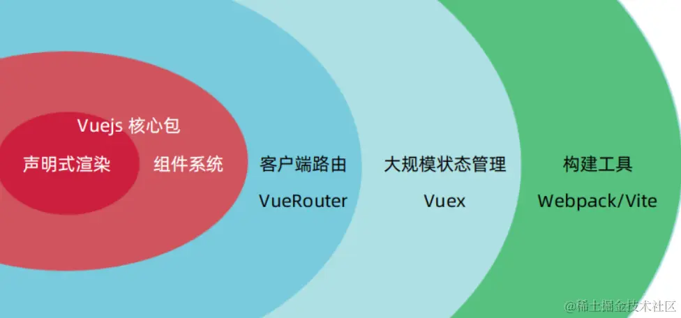

Vue 的特点：

- 采用**组件化**模式，提高代码复用率，且让代码更好维护
- **声明式编码**，让编程人员无需直接操作 DOM，提高开发效率
- 使用**虚拟 DOM** + **优秀的 Diff 算法**，尽量复用 DOM 节点

## MVVM

MVVM 是 Vue 实现数据驱动视图和双向数据绑定的核心原理。MVVM 指的是 Model、View 和 ViewModel，它把每个 HTML 页面都拆分成了这三个部分，如图所示：

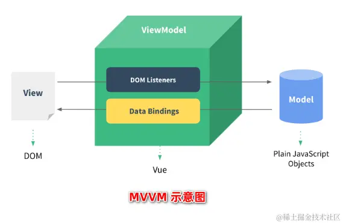

> `Model`：表示当前页面渲染时所依赖的数据源
>
> `View`：表示当前页面所渲染的 DOM 结构
>
> `ViewModel`：表示 vue 的实例，它是 MVVM 的核心

ViewModel 作为 MVVM 的核心，是它把当前页面的数据源（Model）和页面的结构（View）连接在了一起

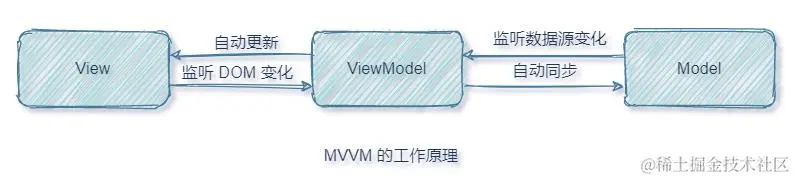

当数据源发生变化时，会被 ViewModel 监听到，VM 会根据最新的数据源自动更新页面的结构

当表单元素的值发生变化时，也会被 VM 监听到，VM 会把变化过后最新的值自动同步到 Model 数据源中

## 基本使用

### 创建 Vue 实例

国内 CDN：[BootCDN](https://link.juejin.cn/?target=https%3A%2F%2Fwww.bootcdn.cn%2F) 、国外 CND：[JSDELIVR](https://link.juejin.cn/?target=https%3A%2F%2Fwww.jsdelivr.com%2F)

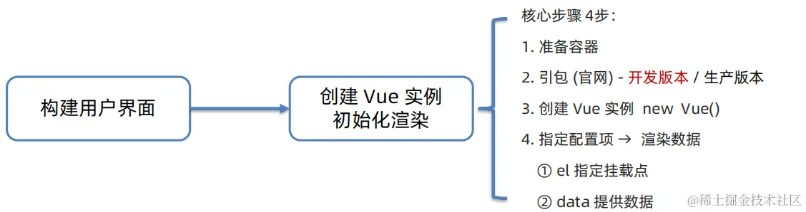

每一个 Vue 应用由一个通过 `new Vue` 创建的**根 Vue 实例**，以及可选的嵌套的、可复用的组件树组成

当创建一个根 Vue 实例时，你可以传入一个**选项对象** (完整选项对象查看[官网](https://link.juejin.cn/?target=https%3A%2F%2Fv2.cn.vuejs.org%2Fv2%2Fapi%2F%23%E9%80%89%E9%A1%B9-%E6%95%B0%E6%8D%AE))。data 中的数据，可以通过**插值表达式**`{{}}`渲染到页面中

- 使用的数据必须存在 `data` 中
- 支持的是**表达式**，而非**语句**
- **不能在标签属性**上使用 `{{}}` 插值

```html
<!-- Vue所管理的范围 -->
<div id="app">
  <!-- 插值表达式，用于渲染数据到页面 -->
  <h1>{{ msg }}</h1>
  <a href="#">{{ count }}</a>
</div>
<!-- 引入开发版本包 - 包含完整的注释和警告 -->
<script src="https://cdn.jsdelivr.net/npm/vue@2.7.14/dist/vue.js"></script>
<script>
  // 引入VueJS核心包后，在全局环境就有了Vue构造函数
  new Vue({
    // 通过 el 配置选择器，指定 Vue 管理的是哪个容器，值通常为css选择器字符串
    el: "#app",
    // 通过 data 提供数据
    data: {
      msg: "Hello World",
      count: 666,
    },
  });
</script>
```

所有的 Vue 组件都是 Vue 实例，并且接受相同的选项对象 (一些根实例特有的选项除外)，容器与 Vue 实例之间是一 一对应的关系

Vue 实例还暴露了一些有用的实例属性与方法，它们都有前缀 `$`，以便与用户定义的属性区分开来。例如：

```js
var data = { a: 1 };
var vm = new Vue({
  el: "#example",
  data: data,
});

vm.$data === data; // => true
vm.$el === document.getElementById("example"); // => true

// $watch 是一个实例方法
vm.$watch("a", function (newValue, oldValue) {
  // 这个回调将在 `vm.a` 改变后调用
});
```

> 可以在官网 [API 参考](https://link.juejin.cn/?target=https%3A%2F%2Fv2.cn.vuejs.org%2Fv2%2Fapi%2F%23%E5%AE%9E%E4%BE%8B-property)中查阅到完整的实例 property 和方法的列表

### el 与 data

**el 的两种写法**

```html
<!-- 直接绑定 -->
<script>
  const app = new Vue({
    el:'#app' //第一种写法，直接绑定
    data: {
  	  msg:'hello world'
    }
  })
</script>

<!-- 使用mount函数 -->
<script>
  const app = new Vue({
    data: {
      msg: "hello world",
    },
  });
  app.$mount("#app");
</script>
```

**data 两种写法**

```html
<!-- 对象式 -->
<script>
  const app = new Vue({
    el:'#app'
    data: {
      msg:'hello world'
    }
  })
</script>

<!-- 函数式 -->
<script>
  const app = new Vue({
    el:'#app'
    data:function(){
      return {
        msg:'hello world'
      }
    }
  })
</script>
```

> 由 Vue 管理的函数，不要写箭头函数，一旦写了箭头函数，this 可能不再指向 Vue 实例了

### 响应式特性

除了基本的模板渲染，Vue 最主要特征的就是实现了数据响应式（数据变化，视图自动更新）

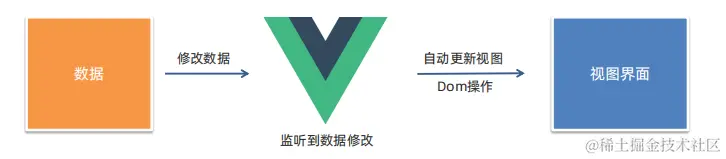

当一个 Vue 实例被创建时，它将 `data` 对象中的所有的属性加入到 Vue 的**响应式系统**中。当这些属性值发生改变时，视图将会产生“响应”，即匹配更新为新的值

```js
// 我们的数据对象
var data = { a: 1 };

// 该对象被加入到一个 Vue 实例中
var vm = new Vue({
  data: data,
});

// 获得这个实例上的 property
// 返回源数据中对应的字段
vm.a == data.a; // => true

// 设置 property 也会影响到原始数据
vm.a = 2;
data.a; // => 2

// ……反之亦然
data.a = 3;
vm.a; // => 3
```

值得注意的是，只有当实例被创建时就已经存在于 `data` 中的属性才是**响应式**的。也就是说如果你添加一个新的 property，比如`vm.b = 'hi'`，那么对 `b` 的改动将不会触发任何视图的更新，这就叫数据丢失响应式

## 生命周期

Vue 生命周期指一个 Vue 实例从**创建**到**销毁**的整个过程

**生命周期的四个阶段：① 创建 ② 挂载 ③ 更新 ④ 销毁**

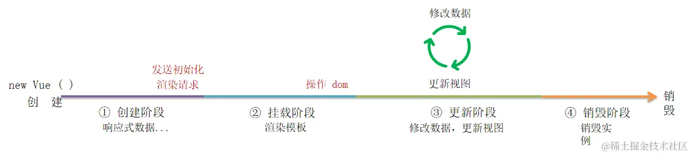

Vue 生命周期过程中，会自动运行一些函数（生命周期钩子）让开发者可以在**特定阶段**运行自己的代码

这些生命周期钩子函数提供了在组件不同阶段执行代码的机会，我们可以根据需求在特定的生命周期函数中处理数据、发送请求、监听事件等操作。生命周期函数的执行顺序是固定的，遵循前后依赖关系

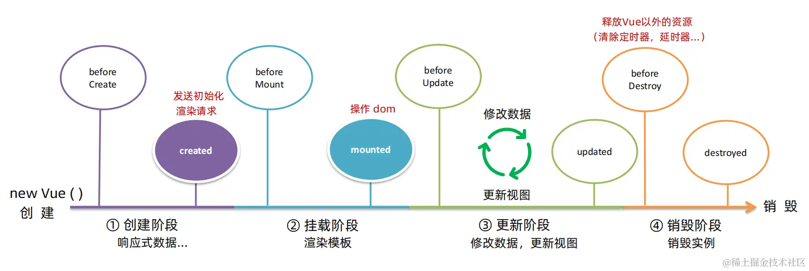

Vue2 组件的生命周期分为八个阶段，分别是：

| 生命周期阶段                                                           | 调用函数        |
| ---------------------------------------------------------------------- | --------------- |
| 将要创建（在实例创建之前，此时对象还未被初始化，无法访问 data 等属性） | `beforeCreate`  |
| 创建完毕（实例创建完成，可以访问 data 等属性，但 DOM 节点还未被挂载）  | `created`       |
| 将要挂载（在 Vue 实例挂载到 DOM 节点之前调用，此时模板编译已完成）     | `beforeMount`   |
| 挂载完毕（Vue 实例已经挂载到 DOM 节点上，可以进行 DOM 操作）           | `mounted`       |
| 将要更新（在数据更新之前调用，DOM 还未更新）                           | `beforeUpdate`  |
| 更新完毕（数据已经更新，DOM 已经重新渲染）                             | `updated`       |
| 将要摧毁（在实例销毁之前调用，此时实例仍可用）                         | `beforeDestroy` |
| 摧毁完毕（实例已经销毁，清理工作完成）                                 | `destroyed`     |

Vue2 生命周期各阶段详细过程如下：

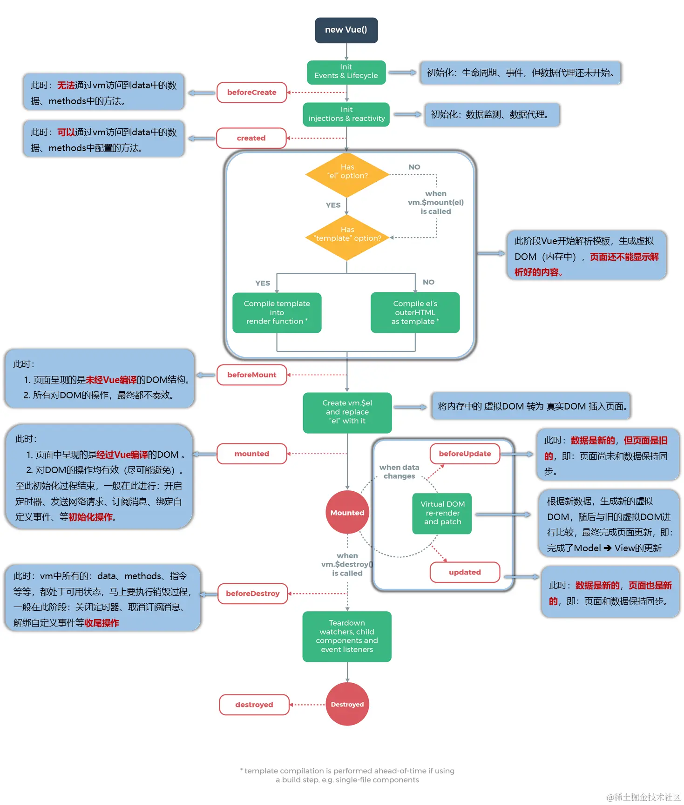

## 开发者工具

Vue Devtools

- 通过[谷歌应用商店](https://link.juejin.cn/?target=https%3A%2F%2Fchrome.google.com%2Fwebstore%2Fdetail%2Fvuejs-devtools%2Fnhdogjmejiglipccpnnnanhbledajbpd)或[极简插件商店](https://link.juejin.cn/?target=https%3A%2F%2Fchrome.zzzmh.cn%2Findex%23%2Findex)安装
- 下载 → 开发者模式 → 拖拽安装 → 插件详情允许访问文件
- 设置完成后，打开 Vue 运行的页面，调试工具中 Vue 栏，即可查看修改数据，进行调试

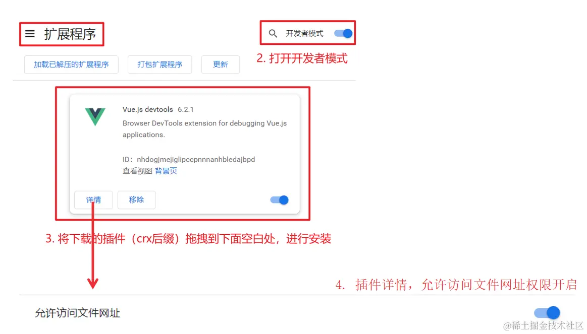

# 模板语法

Vue 使用了基于 HTML 的模板语法，允许开发者声明式地将 DOM 绑定至底层 Vue 实例的数据。**所有 Vue 的模板都是合法的 HTML**

在底层的实现上，Vue 将模板编译成虚拟 DOM 渲染函数。结合响应系统，Vue 能够智能地计算出最少需要重新渲染多少组件，并把 DOM 操作次数减到最少。当然，你也可以不用模板，[直接写渲染 (render) 函数](https://link.juejin.cn/?target=https%3A%2F%2Fv2.cn.vuejs.org%2Fv2%2Fguide%2Frender-function.html)，使用可选的 JSX 语法

## 插值

Vue 模板中，可以在标签中插入**文本**和**原始 HTML**，标签属性中插入**动态属性值**，以及在所有数据绑定中使用**JavaScript 表达式**

- 文本

```html
<span>Message: {{ msg }}</span>
```

- 原始 HTML

双大括号会将数据解释为普通文本，而非 HTML 代码。为了输出真正的 HTML，需要使用 `v-html`

```html
<p>Using v-html directive: <span v-html="rawHtml"></span></p>
```

- 属性

插值表达式语法不能作用在 HTML 属性上，遇到这种情况应该使用`v-bind`

```html
<div v-bind:id="dynamicId"></div>
```

- JavaScript 表达式

对于所有的数据绑定，Vue 都提供了完全的 JavaScript 表达式支持（只能包含**单个表达式**）

```html
{{ number + 1 }} {{ ok ? 'YES' : 'NO' }} {{ message.split('').reverse().join('')
}}

<div v-bind:id="'list-' + id"></div>
```

## 指令

Vue 指令是 Vue 框架中的特殊属性，用于向 HTML 元素添加交互式行为和动态功能。指令以 `v-` 前缀作为识别符，紧跟在指令名称后面的是其表达式或参数，Vue 会根据不同的**指令**，针对标签实现不同的**功能**

指令基本使用如下，这里的 href 就是参数

```html
<a v-bind:href="url">...</a>
```

### 动态参数

用方括号括起来的 JavaScript 表达式作为一个指令的参数

```html
<!-- attributeName 会被作为一个表达式进行动态求值，求得的值将会作为最终的参数来使用 -->
<a v-bind:[attributeName]="url"> ... </a>
```

Vue 中对于动态参数有两类约束：

- **值**的约束

动态参数预期会求出一个字符串，异常情况下值为 `null`。这个特殊的 `null` 值可以被显性地用于移除绑定。任何其它非字符串类型的值都将会触发一个警告

- **表达式**的约束

动态参数表达式中，某些字符，如空格和引号，放在 HTML 属性名里无效

```html
<!-- 这种写法无效 -->
<a v-bind:['foo' + bar]="value"> ... </a>
<!-- 使用计算属性替代这种复杂表达式 -->
```

在 DOM 中使用模板时，需要**避免使用大写字符来命名键名**，浏览器会把属性名全部强制转为小写：

```html
<!-- 在 DOM 中使用模板时这段代码会被转换为 v-bind:[someattr] -->
<a v-bind:[someAttr]="value"> ... </a>
```

### v-html

`v-html`用于设置元素的 `innerHTML`。`v-html`后解析，因此标签内不能继续加其他内容，如插值表达式或文本，会被直接覆盖掉

此外，`v-text`为设置元素的 `innerText`，用于将数据渲染到元素的文本内容中，多数情况下使用`v-html`

```html
<div id="app">
  <div v-html="msg"></div>
</div>

<script>
  const app = new Vue({
    el: "#app",
    data: {
      msg: `<h1>Hello World！</h1>`,
    },
  });
</script>
```

### v-if、v-show

`v-show`：控制元素显示隐藏

- 原理：切换 `display:none` 控制显示隐藏
- 场景：频繁切换显示隐藏的场景

`v-if`：控制元素显示隐藏（**条件渲染**）

- 原理： 基于条件判断，是否**创建**或**移除**元素节点
- 场景： 要么显示，要么隐藏，不频繁切换的场景

```html
<div id="app">
  <div v-show="flag" class="box">我是v-show控制的盒子</div>
  <div v-if="flag" class="box">我是v-if控制的盒子</div>
</div>

<script>
  const app = new Vue({
    el: "#app",
    data: {
      flag: false,
    },
  });
</script>
```

### v-else、v-else-if

`v-else、v-else-if`辅助`v-if`进行判断渲染，需紧挨`v-if`使用

```html
<div id="app">
  <p v-if="gender === 1">性别: 男</p>
  <p v-else>性别: 女</p>
  <hr />
  <p v-if="score >= 90">成绩评定A</p>
  <p v-else-if="score >= 80">成绩评定B</p>
  <p v-else-if="score >= 70">成绩评定C</p>
  <p v-else>成绩评定D</p>
</div>

<script>
  const app = new Vue({
    el: "#app",
    data: {
      gender: 2,
      score: 95,
    },
  });
</script>
```

### v-on

#### 事件绑定

注册事件 = 添加监听 + 提供处理逻辑

- 内联语句：`v-on:事件名 = "内联语句"`

```html
<button v-on:click="count++">按钮</button>
```

- 绑定函数：`v-on:事件名 = "methods中的函数名"`

```html
<button v-on:click="add">按钮</button>
```

- 简写：`@事件名`

```html
<button @click="add">按钮</button>
```

- 传参：

```html
<button @click="add(参数1, 参数2)">按钮</button>
```

#### 事件参数对象

原生 DOM 事件绑定中，可以在事件处理函数的形参处，接收事件参数对象 event

在 v-on 指令所绑定的事件处理函数中，同样可以接收到事件参数对象 event。**Vue 在触发事件回调时，会主动传入 event 事件对象参数**

事件传参有以下四种情况：

- 不传参：`@click="show"` ，收到一个`event` (事件对象)
- 传一个参：`@click="show(6)"` ，收到：`6`
- 传多个参：`@click="show(6, 7, 8)"` ，收到：`6、7、8`
- 传参 + 事件对象：`@click="show($event, 6)"`，收到：`event、6`

`$event`是 Vue 提供的特殊变量，用来表示原生的事件参数对象 event。`$event` 可以解决事件参数对象 event 被覆盖的问题，示例用法如下：

```html
<div id="app">
  <h3>Count的值为:{{ count }}</h3>
  <button v-on:click="addCount(1, $event)">+1</button>
</div>

<script>
  const app = new Vue({
    el: "#app",
    data() {
      return {
        count: 0,
      };
    },
    methods: {
      addCount(num, e) {
        //接收事件参数对象 event
        const nowBgColor = e.target.style.backgroundColor;
        e.target.style.backgroundColor = nowBgColor === "red" ? "" : "red";
        this.count += num;
      },
    },
  });
</script>
```

> `$event`两种使用场景：
>
> - **获取事件对象**：在 DOM 事件的回调函数中传入参数`$event`，可以获取到该事件的事件对象
> - **接收参数**：在子组件中通过`$emit`注册事件，将数据作为参数传入，在父组件中通过`$event`接收（传过来的第一个参数）

### v-bind

#### 基本使用

`v-bind`用于动态设置`HTML`的标签属性

- 语法：`v-bind:属性名="表达式"`
- 简写：`:属性名="表达式"`

```html
<div id="app">
  
  
</div>

<script>
  const app = new Vue({
    el: "#app",
    data: {
      imgUrl: "./imgs/1.png",
      msg: "hello",
    },
  });
</script>
```

#### class 与 style 绑定

Vue 扩展了 v-bind 的语法，可以针对 class 类名 和 style 行内样式 进行控制

##### 操作 class

语法：`:class = "对象/数组"`

- 对象：键就是类名，值是布尔值。如果值为 true，有这个类，否则没有这个类。适用于一个类名来回切换

  ```html
  <div class="box" :class="{ 类名1: 布尔值, 类名2: 布尔值 }"></div>
  ```

- 数组：数组中所有的类，都会添加到盒子上，本质就是一个 class 列表。适用于批量添加或删除类

  ```html
  <div class="box" :class="[ '类名1', '类名2', '类名3' ]"></div>
  ```

- 在数组语法中也可以使用对象语法：

  ```html
  <div :class="[{ 类名1: 布尔值 }, 类名2]"></div>
  ```

> 当在一个自定义组件上使用 `class` 属性时，这些`class`将被添加到该组件的根元素上面。这个元素上已经存在的`class`不会被覆盖，语法与用在标签上类似

##### 操作 style

语法：`:style = "样式对象/数组"`

- `v-bind:style`的对象语法十分直观，看着非常像 CSS，但其实是一个 JavaScript 对象。CSS 属性名可以用驼峰式 (camelCase) 或短横线分隔 (kebab-case) 来命名：

  ```html
  <div :style="{ color: activeColor, fontSize: fontSize + 'px' }"></div>
  ```

- `v-bind:style` 的数组语法可以将多个样式对象应用到同一个元素上：

  ```html
  <div :style="[baseStyles, overridingStyles]"></div>
  ```

- 从 Vue2.3.0 起你可以为 `style` 绑定中的属性提供一个包含多个值的数组，常用于提供多个带前缀的值，例如：

  ```html
  <div :style="{ display: ['-webkit-box', '-ms-flexbox', 'flex'] }"></div>
  ```

  > 这样写只会渲染数组中最后一个被浏览器支持的值。在本例中，如果浏览器支持不带浏览器前缀的 flexbox，那么就只会渲染 `display: flex`

### v-for

基于数据循环，多次渲染整个元素（数组、对象、字符串、数字）

#### 遍历数组

```
v-for = "(item, index) in 数组"
```

- `item`每一项，`index`索引
- `index`可省略：`v-for = "item in 数组"`

#### 遍历对象

```
v-for="(value, key, index) in 对象" :key="index"
```

- `value`值，`key`键，`index`索引
- `key`与`index`可省略：`v-for = "value in 数组"`

#### 遍历字符串

```
v-for="(char, index) in 字符串"
```

- `char`单个字符，`index`索引
- `index`可省略：`v-for="char in 字符串"`

#### 遍历指定次数

```
v-for="(number, index) in 数字"
```

- `number`一个数字，`index`索引
- `index`可省略：`v-for="(number, index) in 数字"`
- 遍历的`number`从 1 开始，`index`索引从 0 开始

### v-model

`v-model`是 Vue 中用于双向数据绑定的指令，它可以在**表单元素**和**组件**之间建立起数据的双向绑定关系（当绑定的数据发生变化时，表单元素或组件的值也会自动更新，反之亦然）

`v-model`语法如下：

```html
<!-- 在表单元素上 -->
<input v-model="dataProperty" />

<!-- 在自定义组件上 -->
<custom-component v-model="dataProperty"></custom-component>
```

`v-model`会忽略所有表单元素的 `value`、`checked`、`selected` 属性的初始值，而总是将 Vue 实例的数据作为数据来源。可以在组件的 `data` 选项中声明初始值。

常见的表单元素都可以用 `v-model` 绑定关联，用于快速**获取**或**设置**表单元素的值，它会根据**控件类型**自动选取**正确的方法**来更新元素（底层已实现）

`v-model`在内部**为不同的输入元素使用不同的属性并抛出不同的事件**：

- text 、textarea 使用`value` 和`input`事件
- checkbox、radio 使用`checked`和`change`事件
- select 使用`value`和`change`事件

使用示例：

```html
<!-- <input :value="username" @input="username = $event.target.value" type="text"> -->
<input v-model="username" type="text" />

<!-- 单个复选框绑定一个布尔值，多个复选框绑定一个数组 -->
<!-- <input :checked="isSingle" @change="isSingle = $event.target.checked" type="checkbox"> -->
<input v-model="isSingle" type="checkbox" />

<!-- <input :checked="gender" @change="gender = $event.target.checked" type="radio"> -->
<input v-model="gender" name="gender" value="male" type="radio" />男
<input v-model="gender" name="gender" value="female" type="radio" />女

<!-- select多选绑数组，单选不是 -->
<!-- <select :value="city" @change="city = $event.target.value" type="text"> -->
<select v-model="city">
  <option value="beijing">北京</option>
  <option value="shanghai">上海</option>
</select>
```

## 指令修饰符

指令修饰符是 Vue 中用于修改指令行为的特殊后缀，可以添加在指令后面，用以改变指令的行为方式。通过 `.` 指明一些指令后缀，不同后缀封装了不同的处理操作，这么做的好处是可以简化代码

### 按键修饰符

在监听键盘事件时，我们经常需要判断详细的按键。此时，可以为键盘相关的事件添加按键修饰符，例如：

| 按键修饰符 | 说明                        |
| ---------- | --------------------------- |
| enter      | 回车                        |
| delete     | 删除 (捕获“删除”和“退格”键) |
| esc        | 退出                        |
| space      | 空格                        |
| up         | 上                          |
| down       | 下                          |
| left       | 左                          |
| right      | 右                          |

Vue 未提供别名的按键，可以使用按键原始的 key 值去绑定，但注意要转为 kebab-case

```html
<input v-on:keyup.page-down="onPageDown" />
```

`Vue.config.keyCodes.自定义键名 = 键码`，可以去定制按键别名

```js
// 可以使用 `v-on:keyup.f1`
Vue.config.keyCodes.f1 = 112;
```

### 事件修饰符

在事件处理函数中调用 `event.preventDefault()` 或 `event.stopPropagation()` 是非常常见的需求。因此，vue 提供了事件修饰符的概念，来辅助程序员更方便的对事件的触发进行控制。常用的 6 个事件修饰符如下：

| 事件修饰符   | 说明                                                     |
| ------------ | -------------------------------------------------------- |
| **.prevent** | 阻止默认行为 (例如：阻止 a 连接的跳转、阻止表单的提交等) |
| **.stop**    | 阻止事件冒泡                                             |
| .capture     | 以捕获模式触发当前的事件处理函数                         |
| .once        | 绑定的事件只触发 1 次                                    |
| .self        | 只有在 event.target 是当前元素自身时触发事件处理函数     |
| .passive     | 事件的默认行为立即执行，无需等待事件回调执行完毕         |
| .native      | 用于监听原生 DOM 事件                                    |

使用示例：

```html
<!-- 此处也可以不用添加点击事件 -->
<!-- 修饰符可以连续写 -->
<a href="https://www.baidu.com" @click.prevent.stop="onLinkClick">百度首页</a>

<!-- 使用事件的捕获模式 -->
<div class="box1" @click.capture="console.log(1)">
  <div class="box2" @click="console.log(2)"></div>
</div>

<!-- 事件只触发一次（常用） -->
<button @click.once="showInfo">点我提示信息</button>

<!-- 只有event.target是当前操作的元素时才触发事件 -->
<div class="demo1" @click.self="showInfo">
  <button>点我提示信息</button>
</div>

<!-- Vue 组件在绑定事件时会自动将事件绑定到组件的根元素上，而不是原生的 DOM 元素上。但是在某些情况下，你可能需要监听组件内部的原生 DOM 事件，这时就可以使用 .native 修饰符 -->
<custom-button @click.native="handleClick">Click me</custom-button>
```

### v-model 修饰符

为了方便对用户输入的内容进行处理，Vue 为 v-model 指令提供了 3 个修饰符，分别是：

| 修饰符      | 作用                                      | 示例                             |
| ----------- | ----------------------------------------- | -------------------------------- |
| **.number** | 自动将用户的输入值转为数值类型            | `<input v-model.numbe r="age"/>` |
| **.trim**   | 自动过滤用户输入的首尾空白字符            | `<input v-model.trim="msg"/>`    |
| .lazy       | 在 change(值改且失焦) 时而非 input 时更新 | `<input v-model.lazy="msg"/>`    |

## 自定义指令

### 基本语法

Vue 允许注册自定义指令，当需要对普通 DOM 元素进行底层操作时，就会用到自定义指令（自定义指令, 可以封装一些 DOM 操作， 扩展额外功能）

- 全局注册：(以注册 focus 为例)

```js
Vue.directive("focus", {
  inserted(el) {
    //可以对 el 标签拓展额外的功能
    el.focus();
  },
});
```

- 局部注册：

```js
directives: {
  "focus": {
    inserted(el) {
      //可以对 el 标签拓展额外的功能
      el.focus()
    }
  }
}
```

注册完毕后可以在任何地方使用该自定义指令：

```html
<input v-focus />
```

### 钩子函数

一个指令定义对象可以提供如下几个钩子函数 (均为可选)：

- `bind`：只调用一次，指令第一次绑定到元素时调用。在这里可以进行一次性的初始化设置
- `inserted`：被绑定元素插入父节点时调用 (仅保证父节点存在，但不一定已被插入文档中)
- `update`：所在组件的 VNode 更新时调用，**但是可能发生在其子 VNode 更新之前**。指令的值可能发生了改变，也可能没有。但是你可以通过比较更新前后的值来忽略不必要的模板更新
- `componentUpdated`：指令所在组件的 VNode **及其子 VNode** 全部更新后调用
- `unbind`：只调用一次，指令与元素解绑时调用

### 钩子函数参数

指令钩子函数会被传入以下参数：

- `el`：指令所绑定的元素，可以用来直接操作 DOM

- ```
  binding
  ```

  ：一个对象，包含以下属性

  - `name`：指令名（不包括 `v-` 前缀）
  - `value`：指令的绑定值
  - `oldValue`：指令绑定的前一个值，仅在 `update` 和 `componentUpdated` 钩子中可用。无论值是否改变都可用
  - `expression`：字符串形式的指令表达式。例如 `v-my-directive="1 + 1"` 中，表达式为 `"1 + 1"`
  - `arg`：传给指令的参数（可选）例如 `v-my-directive:foo` 中，参数为 `"foo"`
  - `modifiers`：一个包含修饰符的对象。例如：`v-my-directive.foo.bar` 中，修饰符对象为 `{ foo: true, bar: true }`

- `vnode`：Vue 编译生成的虚拟节点。移步 [VNode API](https://link.juejin.cn/?target=https%3A%2F%2Fv2.cn.vuejs.org%2Fv2%2Fapi%2F%23VNode-%E6%8E%A5%E5%8F%A3) 来了解更多详情。

- `oldVnode`：上一个虚拟节点，仅在 `update` 和 `componentUpdated` 钩子中可用

### 使用示例

在绑定指令时，可以通过`=`为指令绑定具体的参数值

```html
<div v-color="color">我是内容</div>
```

通过 `binding.value` 可以拿到指令值，指令值修改会触发 `update` 函数

```js
directives: {
  color: {
    // 被绑定元素插入父节点时调用, 只执行一次
    inserted(el, binding) {
      el.style.color = binding.value
    },
    // 指令值修改会 触发 update 函数
    update(el, binding) {
      el.style.color = binding.value
    }
  }
}
```

# 计算属性与侦听器

## 计算属性

基于现有的数据，计算出来的新属性。 依赖的数据变化，自动重新计算。计算属性使用上和普通属性一样

计算属性声明在`computed`配置项中，一个计算属性对应一个函数且必须要有返回值

```js
computed: {
  计算属性名 () {
	//基于现有数据，编写求值逻辑
    return 结果
  }
},
```

**计算属性默认简写，只能访问，不能修改**。如果要修改，需要使用完整写法

- 完整写法：计算属性是一个对象，对象中拥有两个方法（get / set），get 相当于以前的简写函数
- 当计算属性被赋值时，计算属性的`set`会执行

```js
computed: {
  计算属性名: {
    get() {
      //一段代码逻辑（计算逻辑）
      return 结果
  	},
  	set(修改的值) {
      //一段代码逻辑（修改逻辑）
  	}
  }
}
```

> 计算属性与普通方法的区别在于：`computed`具有缓存特性、自动依赖追踪，适用于衍生数据的计算；而`methods`没有缓存和自动追踪依赖，适用于执行函数操作和处理事件

## 侦听器

watch 侦听器用于监视数据变化，执行一些**业务逻辑**或**异步操作**

- 简写

  - **监听器名需要和数据名完全相同，当数据变化时自动执行该函数**
  - 简单类型数据，直接监视
  - 数据是一个对象的属性，可以把函数名定义成：`对象.属性`

  ```js
  watch: {
    数据属性名(newValue, oldValue) {
    	//一些业务逻辑 或 异步操作
    },
    '对象.属性名'(newValue, oldValue) {
    	//一些业务逻辑 或 异步操作
    }
  }
  ```

- 完整写法（添加额外配置项）

  - `deep: true` 对复杂类型深度监视
  - `immediate: true` 初始化立刻执行一次`handler`方法

  ```js
  watch: {
    数据属性名: {
      deep: true, // 深度监视(针对复杂类型)
      immediate: true, // 是否立刻执行一次handler
      handler (newValue, oldValue) {
    	  console.log(newValue, oldValue)
      }
    }
  }
  ```

# 渲染

## 条件渲染

Vue 中的条件渲染是一种**动态展示或隐藏 DOM 元素的方法**，依据的是 JavaScript 表达式的布尔值结果。Vue 提供了多种指令来进行条件渲染，主要包括：

- `v-if`：表达式为 `true` 时，才会渲染元素及其包含的内容；为 `false` 时，Vue 会从 DOM 中移除该元素，从而实现条件渲染的切换
- `v-else`：与 `v-if` 配合使用，表示 `v-if` 条件不满足时要渲染的内容
- `v-else-if`：作为 `v-if` 的延续，用于添加额外的条件分支
- `v-show`：类似于 `v-if`，但不是从 DOM 中移除元素，而是通过 CSS 的 `display` 属性来切换元素的可见性。无论初始条件如何，元素总是会被渲染到 DOM 中

### 使用 template

在 Vue 中，`<template>` 元素配合 `v-if` 指令可以用来实现更灵活的条件渲染。`<template>` 元素**本身不会被渲染到页面上**，它只是一个逻辑容器，可以用来包裹多个元素，形成一组需要根据条件整体显示或隐藏的 DOM 结构

```html
<template v-if="showSectionA">
  <section>
    <h2>Section A</h2>
    <p>This content will only be rendered if showSectionA is true.</p>
  </section>

  <!-- 可以有多个元素 -->
  <div>
    <p>More content under Section A...</p>
  </div>
</template>

<template v-else-if="showSectionB">
  <section>
    <h2>Section B</h2>
    <p>
      This content will render if showSectionA is false and showSectionB is
      true.
    </p>
  </section>
</template>

<template v-else>
  <section>
    <h2>Default Section</h2>
    <p>
      This content will render if neither showSectionA nor showSectionB is true.
    </p>
  </section>
</template>
```

当需要根据同一条件切换多个元素时，`<template>`显得尤为方便

### 用 key 管理可复用元素

Vue 会尽可能高效地渲染元素，**通常会复用已有元素**而不是从头开始渲染

例如，允许用户在不同的登录方式之间切换：

```html
<template v-if="loginType === 'username'">
  <label>Username</label>
  <input placeholder="Enter your username" />
</template>

<template v-else>
  <label>Email</label>
  <input placeholder="Enter your email address" />
</template>
```

上述代码切换 `loginType` 不会清除用户已经输入的内容。因为两个模板使用了相同的元素，`<input>` 不会被替换掉，仅仅是替换了它的 `placeholder`

这样也不总是符合实际需求，所以 Vue 提供了一种方式来表达**“这两个元素是完全独立的，不要复用它们”**。只需添加一个具有唯一值的`key`即可：

```html
<template v-if="loginType === 'username'">
  <label>Username</label>
  <input placeholder="Enter your username" key="username-input" />
</template>
<template v-else>
  <label>Email</label>
  <input placeholder="Enter your email address" key="email-input" />
</template>
```

现在，每次切换时，输入框都将被重新渲染（label 依旧会被复用）

## 列表渲染

Vue 中列表渲染主要通过`v-for`指令来实现，它允许我们遍历数组或对象的数据集合，并基于集合中的每一项生成对应的 DOM 元素

`v-for`除了可以用在 HTML 标签上，也可以用在自定义组件上。不过在自定义组件上使用，必须要带上`key`属性

```html
<my-component v-for="item in items" :key="item.id"></my-component>
```

### 列表渲染中的 key

在 Vue 中，当使用`v-for`指令进行循环渲染时，每个生成的元素都需要具有一个唯一的标识符，以便 Vue 可以跟踪每个元素的状态和重新排序。Vue 通过比较新旧节点的 key 来最小化 DOM 操作，提高性能

`key`属性是 Vue 用来追踪列表渲染的特殊属性，它的主要作用有两个方面：

- **识别每个节点身份**：Vue 会根据每个节点的`key`属性来判断它们的身份，以便高效地复用和更新已有的元素，而不是销毁并重新创建。如果没有使用`key`或者`key`不唯一，Vue 将无法正确追踪每个元素的状态变化，可能导致不必要的渲染错误
- **提高性能**：使用合适的`key`值可以帮助 Vue 优化列表渲染的性能。Vue 会通过比较新旧节点的`key`属性来确定是否需要重新渲染，从而减少不必要的 DOM 操作

> 通常，`key`属性的值（只能是字符串或数字类型）应该是每个元素在循环中的**唯一标识符**，例如在使用数组进行循环时，可以使用数组项的唯一标识符作为`key`属性

有相同父元素的子元素必须有**独特的 key**。重复的 key 会造成渲染错误，最常见的用例是结合 `v-for`：

```html
<ul>
  <li v-for="item in items" :key="item.id">...</li>
</ul>
```

**它也可以用于强制替换元素/组件而不是重复使用它**。当你遇到如下场景时它可能会很有用：

- 完整地触发组件的生命周期钩子
- 触发过渡

例如：

```html
<transition>
  <span :key="text">{{ text }}</span>
</transition>
```

当 `text` 发生改变时，`<span>` 总是会被替换而不是被修改，因此会触发过渡

### 数组更新检测

Vue 将被侦听的数组的变更方法进行了包裹，所以它们也将会触发视图更新。这些被包裹过的方法包括：

- `push()`
- `pop()`
- `shift()`
- `unshift()`
- `splice()`
- `sort()`
- `reverse()`

除了以上方法，其他数组方法不会触发视图更新，当使用这类方法时，可以用新数组替换旧数组：

```js
example1.items = example1.items.filter(function (item) {
  return item.message.match(/Foo/);
});
```

**这么做不会导致 Vue 丢弃现有 DOM 并重新渲染整个列表。** Vue 为了使得 DOM 元素得到最大范围的重用而实现了一些智能的启发式方法，所以用一个含有相同元素的数组去替换原来的数组是非常高效的操作

### 使用 template

类似于 `v-if`，你也可以利用带有 `v-for` 的 `<template>` 来循环渲染一段包含多个元素的内容。比如：

```html
<ul>
  <template v-for="item in items">
    <li>{{ item.msg }}</li>
    <li class="divider" role="presentation"></li>
  </template>
</ul>
```

### v-for 与 v-if 一起用

当它们处于同一节点，`v-for` 的优先级比 `v-if` 更高 (Vue3 相反)，这意味着 `v-if` 将分别重复运行于每个 `v-for` 循环中

当你只想为**部分项**渲染节点时，这种优先级的机制会十分有用，如下：

```html
<li v-for="todo in todos" v-if="!todo.isComplete">{{ todo }}</li>
```

上面的代码将只渲染未完成的 todo。当然，十分不推荐这么做，会损耗很大的性能

# 组件

## 基本示例

这里有一个 Vue 组件的示例：

```js
// 定义一个名为 button-counter 的新组件
Vue.component("button-counter", {
  data: function () {
    return {
      count: 0,
    };
  },
  template:
    '<button v-on:click="count++">You clicked me {{ count }} times.</button>',
});
```

组件是可复用的 Vue 实例，且带有一个名字：在这个例子中是 `<button-counter>`。我们可以在一个通过 `new Vue` 创建的 Vue 根实例中，把这个组件作为自定义元素来使用：

```html
<div id="components-demo">
  <button-counter></button-counter>
</div>
<script>
  new Vue({ el: "#components-demo" });
</script>
```

因为组件是可复用的 Vue 实例，所以它们与 new Vue 接收相同的选项，例如`data、computed、watch、methods` 以及生命周期钩子等。仅有的例外是像`el`这样根实例特有的选项

## 组件组成

Vue 组件由三个主要部分组成：`template`、`style`、`script`。每个组件必须包含`template`模板结构，而`script`行为和`style`样式是可选的组成部分

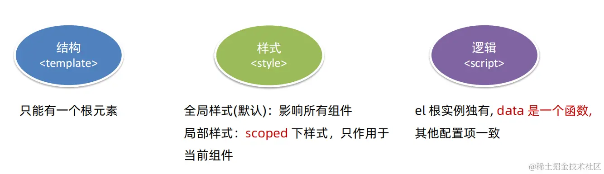

### template

每个组件对应的模板结构，需要定义到 `<template>` 节点中

```html
<template>
  <!-- 当前组件的 DOM 结构，需要定义到 template 标签内部-->
</template>
```

注意：

- template 是 Vue 提供的容器标签，只起到包裹性质的作用，**它不会被渲染为真正的 DOM 元素**
- template 中只能包含唯一的根节点

### script

可以在 `<script>` 节点中封装组件的 JavaScript 业务逻辑

```html
<script>
  // 组件相关的 data 数据、methods 方法等都需要定义到 export default 所导出的对象中
  export default {
    data() {
      return {
          //数据
      }
    },
    methods: {...}
  }
</script>
```

> **vue 组件中的 data 必须是一个函数**，不能直接指向一个数据对象，以保证每个组件实例维护独立的一份数据对象。每次创建新的组件实例，都会新执行一次 data 函数，得到一个新对象

### style

组件内的 `<style>` 节点是可选的，可以在 `<style>` 节点中编写样式美化当前组件的 UI 结构

```html
<style lang="scss" scoped>
  h1 {
    font-weight: nomal;
  }
</style>
```

lang 选项为设置 CSS 预编译器；使用 `scoped` 的样式只会应用到当前 Vue 组件自身的模板元素上，不会影响到外部或者嵌套的子组件

### 组件样式冲突

写在组件中的样式会全局生效，很容易造成多个组件之间的样式冲突问题。为解决这个问题，可以给组件 style 标签加上`scoped` 属性

**scoped 原理：**

- 当前组件内**标签**都被添加 `data-v-hash值` 的自定义属性，且当前组件内的元素 hash 值都一样，但与其他组件的 hash 不同
- Vue 在添加样式时，会自动使用属性交集选择器，都被添加 `元素[data-v-hash值]` 的属性选择器

> 必须是当前组件的元素，才会有这个自定义属性，才会被这个样式作用到。此外，当使用`scoped`修饰符时，样式的选择器是动态生成的，因此在编译时无法直接访问这些选择器

`scoped`样式修饰符仅在单文件组件中生效，且不会影响子组件的样式，如果想让某些样式对子组件生效，可以使用 `/deep/` 或`::v-deep`深度选择器

以`/deep/` 为例：

```html
<style lang="less" scoped>
  .title {
    color: blue; /* 不加/deep/时，生效的选择器格式为：.title[data-v-052342ad] 交集选择器 */
  }
  /deep/ .title {
    color: blue; /* 加上/deep/时，生效的选择器格式为：[data-v-052342ad] .title 后代选择器 */
  }
</style>
```

## 组件注册

### 组件名

- 单个单词组成：
  - 第一种写法：`layout`（首字母小写）
  - 第二种写法：`Layout`（首字母大写、推荐）
- 多个单词组成：
  - 第一种写法：`ProjectLayout` 大驼峰命名（PascalCase）多个单词首字母大写
  - 第二种写法：`project-layout` 烤串命名（kebab-case）多个单词之间用`-`连接

### 局部注册

只能在注册的组件内使用，当成 HTML 标签使用： `<组件名></组件名>`

```js
// 导入需要注册的组件
import ProjectHeader from "./components/ProjectHeader";

export default {
  components: {
    //'组件名': 组件对象,
    ProjectHeader: ProjectHeader,
  },
};
```

### 全局注册

所有组件内都能使用，在 `main.js` 内导入，并全局注册 `Vue.component(组件名, 组件对象)`

```js
import ProjectButton from "./components/ProjectButton";
Vue.component("ProjectButton", ProjectButton);
```

也可以自动化的全局注册

```js
import Vue from "vue";
import upperFirst from "lodash/upperFirst";
import camelCase from "lodash/camelCase";

const requireComponent = require.context(
  // 其组件目录的相对路径
  "./components",
  // 是否查询其子目录
  false,
  // 匹配基础组件文件名的正则表达式
  /Base[A-Z]\w+\.(vue|js)$/
);

requireComponent.keys().forEach((fileName) => {
  // 获取组件配置
  const componentConfig = requireComponent(fileName);

  // 获取组件的 PascalCase 命名
  const componentName = upperFirst(
    camelCase(
      // 获取和目录深度无关的文件名
      fileName
        .split("/")
        .pop()
        .replace(/\.\w+$/, "")
    )
  );

  // 全局注册组件
  Vue.component(
    componentName,
    // 如果这个组件选项是通过 `export default` 导出的，
    // 那么就会优先使用 `.default`，
    // 否则回退到使用模块的根。
    componentConfig.default || componentConfig
  );
});
```

## Prop

```
prop`是一种用于父组件向子组件传递数据的机制。通过在子组件中定义`props`属性，可以声明需要从父组件接收的数据，并在子组件中使用这些数据。可以传递**任意数量**、**任意类型**的`prop
```

HTML 中的属性名大小写不敏感，**浏览器会把所有大写字符解释为小写字符。**当使用 DOM 中的模板时，camelCase 的 prop 名需要使用其等价的 kebab-case 命名：

```html
<!-- prop 中为 postTitle，在模板中改为 post-title -->
<blog-post post-title="hello!"></blog-post>
```

> 此处使用 camelCase 来命名也生效，这是因为 Vue 在底层已经自动做了转换，为了避免出现问题，建议还是使用 kebab-case 命名法

### Prop 类型

Prop 有两种写法：字符串数组类型、对象类型

- 字符串数组类型

```js
props: ["title", "likes", "isPublished", "commentIds", "author"];
```

- 对象类型

```js
props: {
  title: String,
  likes: Number,
  isPublished: Boolean,
  commentIds: Array,
  author: Object,
  callback: Function,
  contactsPromise: Promise // or any other constructor
}
```

### 传入静态或动态 Prop

Prop 可以传入静态或动态的值

```html
<blog-post title="My journey with Vue"></blog-post>

<!-- 动态赋予一个变量的值 -->
<blog-post v-bind:title="post.title"></blog-post>

<!-- 动态赋予一个复杂表达式的值 -->
<blog-post v-bind:title="post.title + ' by ' + post.author.name"></blog-post>
```

> 这里很好理解，使用`v-bind`，则后面为表达式；不使用则视为字符串

如果你想要将一个对象的所有属性都作为 prop 传入，你可以使用不带参数的 `v-bind` (取代 `v-bind:prop-name`)。例如，对于一个给定的对象 `post`：

```js
post: {
  id: 1,
  title: 'My Journey with Vue'
}
```

下面的模板：

```html
<blog-post v-bind="post"></blog-post>
```

等价于：

```html
<blog-post v-bind:id="post.id" v-bind:title="post.title"></blog-post>
```

Vue 会遍历 `post` 对象的所有属性，并将它们作为独立的`prop`分别传递给子组件。子组件需要在其 `props` 选项中声明相应的`prop`名称才能正常接收到这些属性值

### 单向数据流

所有的 prop 都使得其父子 prop 之间形成了一个**单向下行绑定**，父级 prop 的更新会单向向下流动到子组件中，但是反过来则不行。这样可以防止从子组件意外变更父级组件的状态，从而导致应用的数据流向难以理解

prop 的数据是外部的**不能直接改**，要遵循**单向数据流**，子组件通过 `this.$emit` 让父组件来修改，简单来说就是【数据向下，事件向上】

### Prop 验证

为组件的 prop 指定验证要求，**不符合要求，控制台就会有错误提示**，能够帮助开发者快速发现错误

- 基础写法（类型校验）

```JS
props: {
  // 基础的类型检查 (null 和 undefined 会通过任何类型验证)
  propA: Number,
  // 多个可能的类型
  propB: [String, Number]
}
```

- 完整写法（类型、非空校验、默认值、自定义校验）

```JS
props: {
  propA: {
    type: 类型,  // String、Number、Boolean、Array、Object、Date、Function、Symbol
    required: true, // 是否必填
    // 对象或数组默认值必须从一个工厂函数获取
    default: () => { message: 'hello' }
    validator: function (value) {
      // 自定义校验逻辑，通过返回true，不通过返回false并报错
      return 是否通过校验
    }
  }
}
```

### 非 Prop 的 attribute

非 prop 的 attribute 是指传向一个组件，但是该组件并没有相应 prop 定义的属性

非 prop 的属性会穿透到组件的根元素上。当你在**父组件**中向**子组件**传递一个不在**子组件** `props` 中声明的属性时，Vue 会把这个属性作为一个普通 HTML 属性添加到子组件渲染后的根元素上。例如：

```html
<MyComponent
  id="my-id"
  class="custom-class"
  style="color: red;"
  data-custom="some-value"
/>
```

这里的`id`、`class`、`style` 和 `data-custom` 都会被添加到 `MyComponent` 渲染后的实际 DOM 元素上。因此，这些属性会按照常规 HTML 规则应用到子组件的根元素

对于绝大多数属性来说，从外部提供给组件的值会替换掉组件内部设置好的值。所以如果传入 `type="text"` 就会替换掉 `type="date"` 并把它破坏！对于`id`属性，如果根元素有，则不会替换，因为 HTML 元素不可能有两个`id`属性。对于`class`和`style`会稍微智能一些，即两边的值会被合并起来

#### 禁用 attribute 继承

如果你**不**希望组件的根元素继承 attribute，你可以在组件的选项中设置 `inheritAttrs: false`。此外，可以通过 `inheritAttrs: false` 和 `$attrs`，来手动决定这些 attribute 会被赋予哪个元素

`$attrs`作用如下：

- **传递剩余属性**： 当父组件向子组件传递属性时，子组件只通过 `props` 明确声明并接收部分属性，其余未被声明的属性则会被收集到 `$attrs` 对象中
- **多层组件间的属性透传**： 在多层嵌套组件中，父组件传递给最外层子组件的未声明属性可以通过 `$attrs` 向下传递给子孙组件，使得深层组件也能访问到这些属性，无需逐层显式传递
- **配合 `inheritAttrs` 选项**： 默认情况下，Vue 组件的根元素会继承所有未被 prop 捕获的父级属性，可以通过 `inheritAttrs: false` 修改这一行为，然后利用 `$attrs` 自定义如何分配这些属性

下面是官网的一个例子：

- 通过 `inheritAttrs: false` 和 `$attrs`来注册组件

```js
Vue.component("base-input", {
  // inheritAttrs: false 选项不会影响 style 和 class 的绑定
  inheritAttrs: false,
  props: ["label", "value"],
  template: `
    <label>
      {{ label }}
      <input
        v-bind="$attrs"
        v-bind:value="value"
        v-on:input="$emit('input', $event.target.value)"
      >
    </label>
  `,
});
```

这个模式允许你在使用基础组件的时候更像是使用原始的 HTML 元素，而不会担心哪个元素是真正的根元素：

```html
<base-input
  label="Username:"
  v-model="username"
  required
  placeholder="Enter your username"
></base-input>
```

## 自定义事件

### 事件名

不同于属性名，事件名不存在任何自动化的大小写转换。而是**触发的事件名需要完全匹配监听这个事件所用的名称**

举个例子，如果触发一个 camelCase 名字的事件：

```js
this.$emit("myEvent");
```

则监听这个名字的 kebab-case 版本是不会有任何效果的：

```html
<!-- 没有效果 -->
<my-component v-on:my-event="doSomething"></my-component>
```

### v-model

`v-model`本质上是一个**语法糖**，大多数情况下，是 **value 属性** 和 **input 事件** 的简写

```html
<input v-model="msg" type="text" />
<!-- 等价于 -->
<input :value="msg" @input="msg = $event.target.value" type="text" />
```

**在组件中会有例外，**`vue2` 给组件提供了 `model` 属性，可以让用户自定义**传值的 prop 名**和**更新值的事件名**。这就是用户自定义组件能够支持`v-model`的核心

`model` 属性本身是有默认值的，如下：

```js
model: {
  prop: 'value',
  event: 'input'
}
```

也就是说，如果你不定义 `model` 属性，或者你按照当面方法定义属性，当其他人使用你的自定义组件时，`v-model="message"` 就完全等价于 `:value="message"` 加上 `@input="message = $event"`

如果把 `model` 属性进行一些改装，如下：

```js
model: {
  prop: 'checked',
  event: 'change'
}
```

那么，`v-model="message"` 就等价于 `:checked="message"` 加上 `@change="message = $event"`

看官网的例子：

```js
Vue.component("base-checkbox", {
  model: {
    prop: "checked",
    event: "change",
  },
  props: {
    // 仍然需要声明
    checked: Boolean,
  },
  template: `<input
      type="checkbox"
      v-bind:checked="checked"
      v-on:change="$emit('change', $event.target.checked)"
    >`,
});
```

现在在这个组件上使用 `v-model` 的时候：

```html
<base-checkbox v-model="lovingVue"></base-checkbox>
<!-- 等价于 -->
<base-checkbox :value="lovingVue" @change="lovingVue = $event"></base-checkbox>
```

这里的 `lovingVue` 的值将会传入这个名为 `checked` 的 prop。同时当 `<base-checkbox>` 触发一个 `change` 事件并附带一个新的值的时候，这个 `lovingVue` 的值将会被更新

> 注意你仍然需要在组件的 `props` 选项里声明 `checked` 这个 prop

### 原生事件绑定到组件

可以使用 `v-on` 的 `.native` 修饰符来在一个组件的根元素上直接监听一个原生事件

```html
<base-input v-on:focus.native="onFocus"></base-input>
```

有的时候这是很有用的，不过在你尝试监听一个类似 `<input>` 的非常特定的元素时，这会不生效。比如上述 `<base-input>` 组件可能做了如下重构，所以根元素实际上是一个 `<label>` 元素：

```html
<label>
  {{ label }}
  <input
    v-bind="$attrs"
    v-bind:value="value"
    v-on:input="$emit('input', $event.target.value)"
  />
</label>
```

> 此时父级的 `.native` 监听器将静默失败，它不会产生任何报错。但是 `onFocus` 处理函数不会如你预期地被调用

为了解决这个问题，Vue 提供了 `$listeners` ，它是一个对象，里面包含了作用在这个组件上的所有监听器。例如：

```js
{
  focus: function (event) { /* ... */ }
  input: function (value) { /* ... */ },
}
```

有了 `$listeners` ，你就可以配合 `v-on="$listeners"` 将所有的事件监听器指向这个组件的某个特定的子元素。对于类似 `<input>` 的你希望它也可以配合 `v-model` 工作的组件来说，为这些监听器创建一个类似下述 `inputListeners` 的计算属性通常是非常有用的：

```js
Vue.component("base-input", {
  inheritAttrs: false,
  props: ["label", "value"],
  computed: {
    inputListeners: function () {
      var vm = this;
      // `Object.assign` 将所有的对象合并为一个新对象
      return Object.assign(
        {},
        // 我们从父级添加所有的监听器
        this.$listeners,
        // 然后我们添加自定义监听器，
        // 或覆写一些监听器的行为
        {
          // 这里确保组件配合 `v-model` 的工作
          input: function (event) {
            vm.$emit("input", event.target.value);
          },
        }
      );
    },
  },
  template: `
    <label>
      {{ label }}
      <input
        v-bind="$attrs"
        v-bind:value="value"
        v-on="inputListeners"
      >
    </label>
  `,
});
```

现在 `<base-input>` 组件是一个**完全透明的包裹器**了，也就是说它可以完全像一个普通的 `<input>` 元素一样使用了。所有跟它相同的 attribute 和监听器都可以工作，不必再使用 `.native` 监听器

### .sync 修饰符

Vue 中提倡单向数据流，即父组件向子组件传递数据（props），子组件不应直接修改父组件的 props，否则可能导致数据流混乱，难以追踪变更源头。因此，Vue 不推荐使用真正的双向绑定

Vue 推荐的做法是：

- 子组件通过触发一个特定格式的事件（如`update:title`）来告知父组件更新相应的 prop 值

```js
props: {
  title: Boolean;
}
this.$emit("update:title", newTitle);
```

- 父组件则通过监听这个事件并执行回调函数来更新本地的数据属性

```html
<text-document
  v-bind:title="doc.title"
  v-on:update:title="doc.title = $event"
></text-document>
```

这种模式有一个缩写形式，即 `.sync` 修饰符：(`:属性名` 和 `@update:属性名` 的合写)

```html
<!-- .sync不能和表达式一起用，其他情况可以 -->
<text-document v-bind:title.sync="doc.title"></text-document>
```

当我们用一个对象同时设置多个 prop 的时候，也可以将这个 `.sync` 修饰符和 `v-bind` 配合使用：

```html
<text-document v-bind.sync="doc"></text-document>
```

这样会把 `doc` 对象中的每一个属性 (如 `title`) 都作为一个独立的 prop 传进去，然后各自添加用于更新的 `v-on` 监听器

## 组件通信

组件的数据是独立的，无法直接访问其他组件的数据，想用其他组件的数据就要用到**组件通信**：指**组件与组件**之间的数据传递或消息的传递和交流的过程

组件关系分类如下：

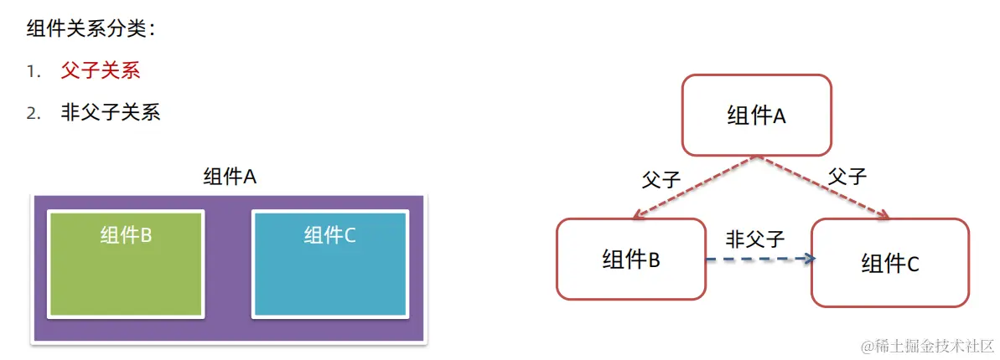

### 父子通信

- **父组件向下传递数据**：通过定义并绑定 props 到子组件
- **子组件向上发送事件**：通过 `$emit` 触发自定义事件，并由父组件监听和响应这些事件来更新自身状态或执行相关逻辑

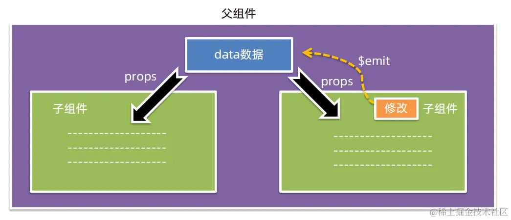

### 非父子通信

#### 事件总线

事件总线（Event Bus）是一种在组件之间进行通信的模式。它允许组件之间通过发布和订阅事件的方式进行解耦和通信，而不需要显式地引用或依赖彼此

在 Vue.js 中，可以使用一个全局的事件总线来实现事件的发布和订阅。通常，可以通过创建一个新的 Vue 实例作为事件总线来实现。使用方式有两种：Vue 原型对象上挂载一个 Vue 实例对象 bus、抽离成一个单独的 js 文件，并将其导出

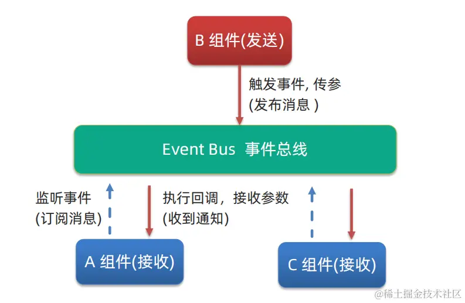

##### 挂载到 Vue 原型对象

- 挂载到 Vue 原型对象上

```js
// 通常是在 main.js 中
import Vue from "vue";
const bus = new Vue();
Vue.prototype.$bus = bus;
```

> 此时，可以在任何 Vue 组件中通过 `this.$bus` 来访问和使用这个 bus 对象

- 在发送事件的组件中，可以使用 `$emit` 方法发布事件

```js
this.$bus.$emit("eventName", eventData);
```

- 在接收事件的组件中，可以使用 `$on` 方法订阅事件

```js
this.$bus.$on("eventName", (eventData) => {
  // 处理事件
});
```

##### 抽离成 js 文件

- 创建事件总线

```js
// EventBus.js
import Vue from "vue";
const Bus = new Vue();
export default Bus;
```

- 在发送事件的组件中，使用 `$emit` 方法发布事件

```js
import tBus from "./EventBus.js";
// 发布事件
Bus.$emit("eventName", eventData);
```

- 在接收事件的组件中，使用 `$on` 方法订阅事件

```js
import Bus from "./EventBus.js";
// 订阅事件
Bus.$on("eventName", (eventData) => {
  // 处理事件
});
```

#### 依赖注入

`provide`和`inject`是一对高级特性，可以在组件树中上层组件提供数据，然后在下层组件中注入并使用这些数据，用于跨层级共享数据

可以把依赖注入看作一部分“大范围有效的 prop”，除了：

- 祖先组件不需要知道哪些后代组件使用它提供的 property
- 后代组件不需要知道被注入的 property 来自哪里

使用示例如下：

- 父组件 provide 提供数据

```js
export default {
  provide() {
    return {
      // 普通类型[非响应式]
      color: this.color,
      // 复杂类型[响应式]
      userInfo: this.userInfo,
    };
  },
};
```

- 子/孙组件 inject 取值使用

```js
export default {
  inject: ["color", "userInfo"],
  created() {
    console.log(this.color, this.userInfo);
  },
};
```

## 插槽

### 默认插槽

默认插槽的主要作用是让组件内部的一些**结构**支持**自定义**

- 组件内需要定制的结构部分，改用`<slot></slot>`占位
- 使用组件时， 在组件标签内部传入自定义结构来替换 `slot`

```html
<!-- 在Card组件中 -->
<template>
  <div class="card">
    <div class="card-header">标题</div>
    <div class="card-body">
      <!-- 这里是默认插槽的位置 -->
      <slot></slot>
    </div>
  </div>
</template>

<!-- 使用Card组件 -->
<Card>
  <!-- 此处会替换slot -->
  <p>这是卡片的主要内容</p>
  <p>可以是文本、图片等各种元素</p>
</Card>
```

插槽后备内容（默认值）：

- 封装组件时，可以为预留的 `<slot>` 插槽提供后备内容（默认内容）
- 外部使用组件时，不传内容，则 `slot` 会显示后备内容；外部使用组件时，传入内容，则 `slot` 整体会被替换

```html
<!-- 在Card组件中 -->
<template>
  <div class="card">
    <div class="card-header">标题</div>
    <div class="card-body">
      <slot><p>这是插槽后备内容</p></slot>
    </div>
  </div>
</template>
```

### 具名插槽

**具名插槽**，顾名思义就是具有名字的插槽，可以将一个组件中的**多处结构**进行定制

具名插槽语法：

- 多个 slot 使用 **name** 属性区分名字（子组件中）

```html
<div class="dialog-header">
  <slot name="head"></slot>
</div>
<div class="dialog-content">
  <slot name="content"></slot>
</div>
<div class="dialog-footer">
  <slot name="footer"></slot>
</div>
```

- template 配合 `v-slot:插槽名` 来分发对应标签（父组件中）

```html
<MyDialog>
  <!-- v-slot 只能用在template上（官网有一种特殊情况） -->
  <template v-slot:head> 大标题 </template>
  <template v-slot:content> 内容文本 </template>
  <template v-slot:footer>
    <button>按钮</button>
  </template>
</MyDialog>
```

> ```
> v-slot:插槽名`可以简化成 `#插槽名`，此外插槽默认名为 `default
> ```

### 作用域插槽

定义`slot`插槽的同时是可以传值的。插槽上可以绑定数据，将来使用组件时可以使用

作用域插槽：将数据从子组件通过插槽传递给父组件

- 在子组件的`slot`上绑定数据
- 在父组件中使用`template`配合`v-slot`取值

为了让 `user` 在父级的插槽内容中可用，我们可以将 `user` 作为 `<slot>` 元素的一个属性绑定上去：

```html
<span>
  <!-- :user 相当于往插槽上加了一个属性, 最终以对象包裹属性的形式传递过去{ user: user} -->
  <slot v-bind:user="user"> {{ user.lastName }} </slot>
</span>
```

绑定在 `<slot>` 元素上的属性被称为**插槽 prop**。现在在父级作用域中，我们可以使用带值的 `v-slot` 来定义我们提供的插槽 prop 的名字：

```html
<current-user>
  <!-- <template #default="slotProps"> -->
  <!-- 如果不用 # 也可以不指定名字, 直接写为 v-slot="变量名"，不过使用多个插槽时不能这么做 -->
  <template v-slot:default="slotProps">
    {{ slotProps.user.firstName }}
  </template>
</current-user>
```

> 在这个例子中，我们选择将包含所有插槽 prop 的对象命名为 `slotProps`，也可以使用任意命名。此外，插槽也是可以解构的

### 动态插槽名

[动态指令参数](https://link.juejin.cn/?target=https%3A%2F%2Fv2.cn.vuejs.org%2Fv2%2Fguide%2Fsyntax.html%23%E5%8A%A8%E6%80%81%E5%8F%82%E6%95%B0)也可以用在 `v-slot` 上，来定义动态的插槽名：

```html
<base-layout>
  <template v-slot:[dynamicSlotName]>
    ...
  </template>
</base-layout
```

### 插槽新旧版本语法

```html
<!-- 具名插槽 -->
<!-- vue2.6.0以下版本的书写方式 -->
<template slot="header">
  <div>header头部</div>
</template>
<!-- vue2.6.0以上版本书写方式 -->
<template v-slot:content>
  <div>content内容区位</div>
</template>
<!-- vue2.6.0以上版本的书写语法糖 -->
<template #footer>
  <div>footer尾部</div>
</template>

<!-- 作用域插槽 -->
<!-- vue2.6.0以下版本的书写方式 -->
<template slot="params" slot-scope="{names}"> 姓名 {{names}} </template>
<!-- vue2.6.0以上版本书写方式 -->
<template v-slot:gender="{gender}"> 性别 {{gender}} </template>
<!-- vue2.6.0以上版本的书写语法糖 -->
<template #age="{age}"> 年龄 {{age}} </template>
```

> 了解新旧版本语法，有助于理解 ElementUI 组件库中的部分插槽写法，ElementUI 使用的是旧版插槽语法。当然，在 Vue3 中已经完全废弃了老语法

## 动态组件与异步组件

### 动态组件使用`<keep-alive>`

可以在一个多标签的界面中使用 `is` attribute 来切换不同的组件：

```html
<component v-bind:is="currentTabComponent"></component>
```

当在这些组件之间切换的时候，有时会想保持这些组件的状态，以避免反复重新渲染导致的性能问题

为了解决这个问题，我们可以用一个`<keep-alive>` 元素将其动态组件包裹起来

```html
<!-- 失活的组件将会被缓存！-->
<keep-alive>
  <component v-bind:is="currentTabComponent"></component>
</keep-alive>
```

`<keep-alive>` 是 Vue 的内置组件，当它包裹动态组件时，会缓存不活动的组件实例，而不是销毁它们，防止重复渲染 DOM，减少加载时间及性能消耗，提高用户体验性。`<keep-alive>` 是一个抽象组件，它自身不会渲染成一个 DOM 元素，也不会出现在父组件链中

此外， `<keep-alive>` 要求被**切换到的组件都有自己的名字**，不论是通过组件的 `name` 选项还是局部 / 全局注册

`<keep-alive>`的三个属性：

- `include`：字符串、正则表达式或数组。只有名称匹配的组件会被缓存
- `exclude`：字符串、正则表达式或数组。任何匹配的组件都不会被缓存

```html
<!-- 逗号分隔字符串 -->
<keep-alive include="a,b">
  <component :is="view"></component>
</keep-alive>

<!-- 正则表达式 (使用 v-bind) -->
<keep-alive :include="/a|b/">
  <component :is="view"></component>
</keep-alive>

<!-- 数组 (使用 v-bind) -->
<keep-alive :include="['a', 'b']">
  <component :is="view"></component>
</keep-alive>
```

- `max`：数字。最多可以缓存多少组件实例。一旦这个数字达到了，在新实例被创建之前，已缓存组件中最久没有被访问的实例会被销毁掉

```html
<!-- <keep-alive> 不会在函数式组件中正常工作，因为它们没有缓存实例 -->
<keep-alive :max="10">
  <component :is="view"></component>
</keep-alive>
```

`<keep-alive>`的使用会触发两个生命周期函数

- `activated`：当组件被激活（使用）的时候触发（进入这个页面的时候触发）

  ```js
  activated () {
    console.log('activated 激活 → 进入页面');
  },
  ```

- `deactivated`：当组件不被使用的时候触发（离开这个页面的时候触发）

  ```js
  deactivated() {
    console.log('deactivated 失活 → 离开页面');
  }
  ```

> 组件缓存后就不会执行组件的 created、mounted、destroyed 等钩子了。所以其提供了 activated 和 deactivated 钩子，帮我们实现业务需求

### 异步组件

在大型应用中，需要将应用分割成小一些的代码块，且只在需要的时候才从服务器加载

Vue 允许你以一个工厂函数的方式定义你的组件，这个工厂函数会异步解析你的组件定义。Vue 只有在这个组件需要被渲染的时候才会触发该工厂函数，且会把结果缓存起来供未来重渲染。例如：

```js
Vue.component("async-example", function (resolve, reject) {
  setTimeout(function () {
    // 向 `resolve` 回调传递组件定义
    resolve({
      template: "<div>I am async!</div>",
    });
  }, 1000);
});
```

工厂函数会收到一个 `resolve` 回调，这个回调函数会在你从服务器得到组件定义的时候被调用

如何获取组件取决于个人，官网推荐的做法是将异步组件和 [webpack 的 code-splitting 功能](https://link.juejin.cn/?target=https%3A%2F%2Fwebpack.js.org%2Fguides%2Fcode-splitting%2F)一起配合使用：

```js
Vue.component("async-webpack-example", function (resolve) {
  // 这个特殊的 `require` 语法将会告诉 webpack
  // 自动将你的构建代码切割成多个包，这些包
  // 会通过 Ajax 请求加载
  require(["./my-async-component"], resolve);
});
```

也可以在工厂函数中返回一个 `Promise`，把 webpack 2 和 ES2015 语法加在一起，可以这样使用动态导入：

```js
Vue.component(
  "async-webpack-example",
  // 这个动态导入会返回一个 `Promise` 对象。
  () => import("./my-async-component")
);
```

当使用[局部注册](https://link.juejin.cn/?target=https%3A%2F%2Fv2.cn.vuejs.org%2Fv2%2Fguide%2Fcomponents-registration.html%23%E5%B1%80%E9%83%A8%E6%B3%A8%E5%86%8C)的时候，你也可以直接提供一个返回 `Promise` 的函数：

```js
new Vue({
  // ...
  components: {
    "my-component": () => import("./my-async-component"),
  },
});
```

> 动态加载组件的写法在路由配置中十分常见

# 工程化开发

工程化开发是指使用各种现代化工具、技术和最佳实践来提高软件开发过程的效率、可靠性和可维护性的一种开发方法。它旨在解决传统开发中出现的一些问题，如复杂的依赖管理、低效的构建过程、缺乏一致性的代码质量等

通过工程化开发，开发团队可以更高效地协作、迭代和交付软件项目，减少人为错误，提高代码质量和项目的可维护性，同时使开发过程更加标准化和可重复

前端工程化方案包括构建工具、自动化测试、代码规范、模块化开发、版本控制等，下面主要介绍 Vue 构建工具 Vue CLI 以及组件化开发的概念

## 脚手架 Vue CLI

### 基本概念

> Vue CLI 构建 Vue 项目的过程本质上就是通过 Webpack 进行构建，Vue CLI 是将 Webpack 集成在其中，简化了配置和操作的过程，提供了更高层次的抽象和命令工具

**使用步骤：**

- 全局安装：`yarn global add @vue/cli` 或 `npm i @vue/cli -g`
- 查看 Vue 版本：`vue --version` 或 `vue -V`
- 创建项目架子：`vue create project-name`（项目名不能用中文，字母也不能大写）
- 启动项目： `yarn serve` 或 `npm run serve`（找 package.json）

> 检查当前的下包地址：（pnpm 类似）
>
> ```bash
>
> npm config get registry
> ```
>
> 把下包的地址切换为国内的淘宝服务器
>
> ```bash
>
> npm config set registry https://registry.npmmirror.com
> ```
>
> 附加：(yarn)
>
> ```bash
>
> npm install -g yarn
>
> yarn config get registry
>
> yarn config set registry https://registry.npmmirror.com -g
>
> yarn config set sass_binary_site http://cdn.npm.taobao.org/dist/node-sass -g
> ```

得到的项目结构如下：

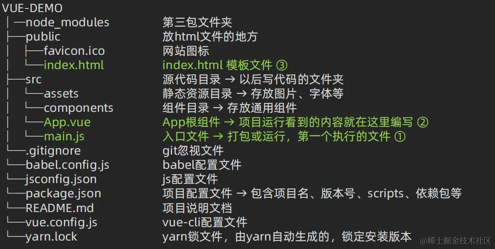

> 在工程化的项目中，Vue 要做的事情很单纯：通过`main.js`把`App.vue`（用来编写待渲染的模板结构） 渲染到`index.html`的指定区域中（index.html 中需要预留一个 el 区域）

`main.js`文件代码详解：

```js
// 引入 Vue 构造函数
import Vue from "vue";
// 引入 App.vue 组件
import App from "./App.vue";
// 配置 Vue 生产版本的提示信息是否显示, false 表示不显示
Vue.config.productionTip = false;

// 创建一个 Vue 实例
new Vue({
  el: "#app", // 指定挂载点, 告诉 Vue 在哪里渲染
  // render: h => h(App), // 挂载什么东西, 把什么东西渲染上去
  render(createElement) {
    // createElement 是一个函数, 它的作用是根据指定的组件创建「元素」
    return createElement(App);
  },
});
```

### 易混淆点

在使用 Webpack（Vue CLI 基于 Webpack）构建 Vue 项目时，Webpack 的执行环境通常是`Node.js`

Webpack 是一个用于打包、构建和管理前端资源的工具，它是基于 Node.js 构建的，其配置文件通常是使用 JavaScript 编写，并通过 Node.js 环境来解析和执行。Webpack 在解析 Vue 应用的入口文件及依赖时，能够处理多种资源类型，包括但不限于 JavaScript、CSS、图片等，并且可以借助各种 loader 和 plugin 对这些资源进行预处理和优化，并生成最终的打包文件

需要注意的是，尽管 Webpack 的执行环境是 Node.js，Webpack 最终生成的打包文件是用于在**浏览器环境**中运行的。Webpack 会根据配置文件的设置将各个模块合并、转换和压缩，最终生成浏览器可执行的 JavaScript、CSS 和其他静态资源文件

关于代码中 `import` 关键字：在现代浏览器环境中，原生支持 ES6 模块导入语法 (`import`)。当 Webpack 处理源代码时，即使源码中使用了`import` 语句，Webpack 也会根据配置将其转换为能够在不同环境下运行的模块加载机制。在 Node.js 环境下，如果未开启 ES 模块支持（默认情况下是 CommonJS 的 `require` 方式），Webpack 会将 `import` 语句转换为 `require` 形式；而在浏览器环境下，Webpack 会生成符合浏览器原生模块加载机制的代码，确保最终生成的 bundle 文件能在浏览器中正确执行

## 组件化开发

- **组件**：Vue 应用程序的可复用、自包含的一部分，用于封装一段特定功能的 HTML 模板、CSS 样式和 JavaScript 逻辑
- **组件化**：一个页面可以拆分成很多组件，每个组件有着自己独立的结构、样式、行为。这样做的好处是便于维护，利于复用，从而能够提升开发效率
- **组件化开发**：根据封装的思想，把页面上可重用的 UI 结构封装为组件，从而方便项目的开发和维护

> 组件分为**普通组件**和**根组件**，其中根组件是整个应用最上层的组件，包裹所有普通小组件

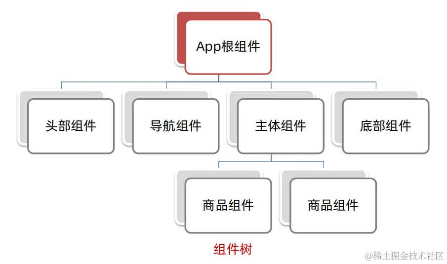

# Vue 进阶语法

## 访问元素或组件

绝大多数情况下，我们最好不要触达另一个组件实例内部或手动操作 DOM 元素。不过也确实在一些情况下做这些事情是合适的

### 访问根组件实例

在每个 `new Vue` 实例的子组件中，其根实例可以通过 `$root` 进行访问。例如，在这个根实例中：

```js
// Vue 根实例
new Vue({
  data: {
    foo: 1,
  },
  computed: {
    bar: function () {
      /* ... */
    },
  },
  methods: {
    baz: function () {
      /* ... */
    },
  },
});
```

所有的子组件都可以将这个实例作为一个全局 store 来访问或使用（大型项目依旧使用 Vuex）

```js
// 获取根组件的数据
this.$root.foo;

// 写入根组件的数据
this.$root.foo = 2;

// 访问根组件的计算属性
this.$root.bar;

// 调用根组件的方法
this.$root.baz();
```

### 访问父组件实例

`$parent` 是一个特殊的属性，用于访问**当前组件的直接父组件实例**。这意味着如果你在一个子组件内部，可以使用 `this.$parent` 来获取父组件的引用，进而访问父组件的公共属性、方法、计算属性或其他暴露给子组件的实例成员

- 父组件

```html
<template>
  <div>
    <h1>{{ title }}</h1>
    <ChildComponent />
  </div>
</template>

<script>
  import ChildComponent from "./ChildComponent.vue";

  export default {
    data() {
      return {
        title: "父组件的标题",
      };
    },
    methods: {
      updateTitle(newTitle) {
        this.title = newTitle;
      },
    },
    components: {
      ChildComponent,
    },
  };
</script>
```

- 子组件

```html
<template>
  <button @click="updateParentTitle">更新标题</button>
</template>

<script>
  export default {
    methods: {
      updateParentTitle() {
        // 通过$parent访问父组件实例
        this.$parent.updateTitle("新的标题");
        // 或者直接访问父组件的数据属性
        this.$parent.title = "新的标题";
      },
    },
  };
</script>
```

### 访问子组件实例或子元素

`ref`是一种在模板中给元素或组件添加引用的方式，通过使用`ref`可以给元素或组件取一个名称，然后通过`this.$refs`来访问引用对象

`ref`用于在 Vue 实例中获取 DOM 元素的属性或方法，或调用组件实例的方法，其查找范围在当前组件内，更加精确与稳定

获取 DOM：

- 目标标签添加 `ref` 属性

```html
<div ref="divRef">我是被标记的容器</div>
```

- 恰当时机，通过 `this.$refs.xxx` 获取目标标签

```js
mounted () {
  console.log(this.$refs.divRef)
}
```

获取组件：

- 目标组件添加 `ref` 属性

```html
<BaseForm ref="baseForm"></BaseForm>
```

- 恰当时机，通过 `this.$refs.xxx`，获取目标组件，就可以调用组件对象里面的方法

```js
this.$refs.baseForm.组件方法();
```

## 程序化的事件侦听器

`$emit`可以被 `v-on` 侦听，但是 Vue 实例同时在其事件接口中提供了其它的方法：

- 通过 `$on(eventName, eventHandler)` 侦听一个事件
- 通过 `$once(eventName, eventHandler)` 一次性侦听一个事件
- 通过 `$off(eventName, eventHandler)` 停止侦听一个事件

你通常不会用到这些，但是当你需要在一个组件实例上手动侦听事件时，它们是派得上用场的。它们也可以用于代码组织工具。例如，你可能经常看到这种集成一个第三方库的模式：

```js
// 一次性将这个日期选择器附加到一个输入框上
// 它会被挂载到 DOM 上。
mounted: function () {
  // Pikaday 是一个第三方日期选择器的库
  this.picker = new Pikaday({
    field: this.$refs.input,
    format: 'YYYY-MM-DD'
  })
},
// 在组件被销毁之前，
// 也销毁这个日期选择器。
beforeDestroy: function () {
  this.picker.destroy()
}
```

这里有两个潜在的问题：

- 它需要在这个组件实例中保存这个 `picker`，如果可以的话最好只有生命周期钩子可以访问到它。这并不算严重的问题，但是它可以被视为杂物
- 我们的建立代码独立于我们的清理代码，这使得我们比较难于程序化地清理我们建立的所有东西

你应该通过一个程序化的侦听器解决这两个问题：

```js
mounted: function () {
  var picker = new Pikaday({
    field: this.$refs.input,
    format: 'YYYY-MM-DD'
  })

  this.$once('hook:beforeDestroy', function () {
    picker.destroy()
  })
}
```

使用了这个策略，我甚至可以让多个输入框元素同时使用不同的 Pikaday，每个新的实例都程序化地在后期清理它自己：

```js
mounted: function () {
  this.attachDatepicker('startDateInput')
  this.attachDatepicker('endDateInput')
},
methods: {
  attachDatepicker: function (refName) {
    var picker = new Pikaday({
      field: this.$refs[refName],
      format: 'YYYY-MM-DD'
    })

    this.$once('hook:beforeDestroy', function () {
      picker.destroy()
    })
  }
}
```

## 混入

### 基础

Mixin（混入）是在 Vue 中用于组件复用的一种机制。通过使用 Mixin，可以将一组选项（如数据、方法、生命周期钩子等）混入到多个组件中，从而实现代码的复用和共享

创建 Mixin：

- 创建一个普通的 JavaScript 对象，作为 Mixin 的定义
- 在 Mixin 对象中定义需要混入到组件中的选项，如数据、方法、生命周期钩子等

```js
// dataMixin.js
export default {
  data() {
    return {
      // 数据
      message: "hello",
      foo: "abc",
    };
  },
  methods: {
    // 方法
    hello() {
      console.log("hello");
    },
  },
  // 钩子函数
  created() {
    this.log("Mixin created");
  },
};
```

使用 Mixin（局部注册）：

- 在组件的选项中使用 `mixins` 数组来引入 Mixin
- 将需要混入的 Mixin 对象添加到 `mixins` 数组中，可以添加多个 Mixin

```js
// dataMixin 为js文件名
mixins: [dataMixin];
```

### 选项合并

当组件和混入对象含有同名选项时，这些选项将以恰当的方式进行合并

合并有以下策略：

- **组件自身的选项具有最高优先级**，会覆盖 Mixin 中的相同选项（生命周期函数除外）
- 如果多个 Mixin 中有相同的选项，后面引入的 Mixin 会覆盖前面的 Mixin
- 同名钩子函数将合并为一个数组，因此都将被调用。另外，混入对象的钩子将在组件自身钩子**之前**调用

### 全局混入

混入也可以进行全局注册。一旦使用全局混入，它将影响**每一个**之后创建的 Vue 实例。使用恰当时，这可以用来为自定义选项注入处理逻辑

- 可以通过 `Vue.mixin` 方法全局注册一个 Mixin
- 全局注册的 Mixin 会自动混入到所有的组件中，无需在组件中显式引入

```js
// 在 main.js 中全局注册
Vue.mixin(dataMixin);
```

## 过滤器

Vue 允许你自定义过滤器，可被用于一些常见的文本格式化。过滤器可以用在两个地方：

- 双花括号`{{}}`插值
- `v-bind` 表达式

过滤器应该被添加在 JavaScript 表达式的尾部，由**管道**符号(`|`)指示：

```html
<!-- 在双花括号中 -->
{{ message | capitalize }}

<!-- 在 v-bind 中 -->
<div v-bind:id="rawId | formatId"></div>
```

可以在一个组件的选项中定义局部过滤器：

```js
filters: {
  capitalize: function (value) {
    if (!value) return ''
    value = value.toString()
    return value.charAt(0).toUpperCase() + value.slice(1)
  }
}
```

或者在创建 Vue 实例之前定义全局过滤器：

```js
Vue.filter("capitalize", function (value) {
  if (!value) return "";
  value = value.toString();
  return value.charAt(0).toUpperCase() + value.slice(1);
});

new Vue({
  // ...
});
```

> 当全局过滤器和局部过滤器重名时，会采用局部过滤器

过滤器函数总接收表达式的值 (之前的操作链的结果) 作为第一个参数。在上述例子中，`capitalize` 过滤器函数将会收到 `message` 的值作为第一个参数

过滤器可以串联：

```js
{
  {
    message | filterA | filterB;
  }
}
```

在这个例子中，`filterA` 被定义为接收单个参数的过滤器函数，表达式 `message` 的值将作为参数传入到函数中。然后继续调用同样被定义为接收单个参数的过滤器函数 `filterB`，将 `filterA` 的结果传递到 `filterB` 中

过滤器是 JavaScript 函数，因此可以接收参数：

```js
{
  {
    message | filterA("arg1", arg2);
  }
}
```

这里，`filterA` 被定义为接收三个参数的过滤器函数。其中 `message` 的值作为第一个参数，普通字符串 `'arg1'` 作为第二个参数，表达式 `arg2` 的值作为第三个参数

## 插件

插件通常用来为 Vue 添加全局功能。插件的功能范围没有严格的限制，一般有下面几种：

1. 添加全局方法或属性
2. 添加全局资源：指令/过滤器/过渡等
3. 通过全局混入来添加一些组件选项
4. 添加 Vue 实例方法，通过把它们添加到 `Vue.prototype` 上实现
5. 一个库，提供自己的 API，同时提供上面提到的一个或多个功能，如`vue-router`

### 使用插件

通过全局方法 `Vue.use()` 使用插件。它需要在你调用 `new Vue()` 启动应用之前完成：

- 参数：`{Object | Function} plugin`
- 注意事项：
  - 安装 Vue.js 插件。如果插件是一个对象，必须提供 `install` 方法
  - 如果插件是一个函数，它会被作为 install 方法
  - install 方法调用时，会将 Vue 作为参数传入
  - 当 install 方法被同一个插件多次调用，插件将只会被安装一次

```js
// 调用 `MyPlugin.install(Vue)`
Vue.use(MyPlugin);

new Vue({
  // ...组件选项
});
```

也可以传入一个可选的选项对象：

```js
Vue.use(MyPlugin, { someOption: true });
```

### 开发插件

Vue.js 的插件应该暴露一个 `install` 方法。这个方法的第一个参数是 `Vue` 构造器，第二个参数是一个可选的选项对象：

```js
MyPlugin.install = function (Vue, options) {
  // 1. 添加全局方法或 property
  Vue.myGlobalMethod = function () {
    // 逻辑...
  }

  // 2. 添加全局资源
  Vue.directive('my-directive', {
    bind (el, binding, vnode, oldVnode) {
      // 逻辑...
    }
    ...
  })

  // 3. 注入组件选项
  Vue.mixin({
    created: function () {
      // 逻辑...
    }
    ...
  })

  // 4. 添加实例方法
  Vue.prototype.$myMethod = function (methodOptions) {
    // 逻辑...
  }
}
```

## Vue 异步更新

在 Vue 中，DOM 的更新是异步执行的，这是因为 Vue 实际上进行了优化以提高性能和效率

当你修改 Vue 实例的数据时，Vue 会触发一个 DOM 更新队列。而 Vue 为了尽可能地减少对真实 DOM 的直接操作，会先将需要更新的 DOM 操作进行缓存，并通过异步方式在合适的时机一次性进行批处理

例如实现编辑标题，编辑框自动聚焦：

- 点击编辑，显示编辑框
- 让编辑框，立刻获取焦点

```js
this.isShowEdit = true; // 显示输入框
this.$refs.inp.focus(); // 获取焦点
```

显示编辑框之后，立刻获取焦点是不能成功的，原因是因为 Vue 是异步更新 DOM 的。如果你需要确保在 DOM 更新完成后执行某些操作，可以使用`$nextTick`方法来处理

- `$nextTick(函数体)`：DOM 更新后，才会触发执行此方法里的函数体。在支持 Promise 的环境中，返回一个 Promise 对象

使用`$nextTick`即可实现点击编辑框后立刻获取焦点：

```js
this.$nextTick(() => {
  this.$refs.inp.focus();
});
```

# 路由

## SPA

SPA (Single Page Application) 单页面应用程序：所有功能在 一个 HTML 页面上实现

- 优点：按需更新性能高，开发效率高，用户体验好
- 缺点：首屏加载慢，不利于 SEO

| 开发分类 | 实现方式       | 页面性能           | 开发效率 | 用户体验 | 学习成本 | 首屏加载 | SEO |
| -------- | -------------- | ------------------ | -------- | -------- | -------- | -------- | --- |
| 单页     | 一个 HTML 页面 | `按需更新、性能高` | `高`     | `非常好` | 高       | 慢       | 差  |
| 多页     | 多个 HTML 页面 | 整页更新、性能低   | 中等     | 一般     | 中等     | 快       | 优  |

Vue 中构建 SPA 意味着：

- 应用程序初始化时加载一个主 HTML 页面，该页面通常包含框架脚本（如 Vue.js）、样式表和其他必要资源
- Vue.js 通过虚拟 DOM（Virtual DOM）技术和组件化思想管理页面内容和状态
- 当用户在应用内导航或执行交互操作时，Vue.js 通过**路由（Vue Router）**在不刷新整个页面的情况下，根据路由地址的变化重新渲染不同的组件或动态更新当前组件的内容
- 数据驱动视图，即当数据模型发生变化时，Vue.js 自动更新相关的 UI 部分，提供流畅的用户体验

**路由即为 SPA 的核心**

## 路由与 VueRouter

路由是一种映射关系，在 Vue 中，路由是**路径**和**组件**的映射关系。根据路由就能知道不同的路径应该匹配渲染哪个组件

VueRouter 是 Vue 官方提供的路由管理器，它作为 Vue 的插件，可以使你构建单页应用程序(SPA)时实现页面之间的导航和路由控制

VueRouter 允许你通过定义路由配置来映射 URL 路径到 Vue 组件，根据 URL 的变化来动态地加载和渲染相应的组件。使用 VueRouter，你可以实现跳转到不同路由，而**不需要刷新页面**，从而实现更流畅和更快速的用户体验

VueRouter 基本使用步骤：

- 下载 VueRouter 模块到当前工程

```bash

npm i vue-router@3
```

- 引入

```js
import VueRouter from "vue-router";
```

- 安装注册

```js
Vue.use(VueRouter);
```

- 创建路由对象

```js
const router = new VueRouter();
```

- 注入，将路由对象注入到 Vue 实例中，建立关联

```js
new Vue({
  render: (h) => h(App),
  router,
}).$mount("#app");
```

VueRouter 核心使用步骤：

- 创建需要的组件 (views 目录)，配置路由规则

```js
import Find from "./views/Find.vue";
import My from "./views/My.vue";
import Friend from "./views/Friend.vue";

const router = new VueRouter({
  routes: [
    { path: "/find", component: Find },
    { path: "/my", component: My },
    { path: "/friend", component: Friend },
  ],
});
```

- 配置导航，配置路由出口 (路径匹配的组件显示的位置)

```html
<div class="footer_wrap">
  <!-- a 标签的 href 要以 # 开头, 不然就会变成页面跳转了! #为锚点-->
  <a href="#/find">发现音乐</a>
  <a href="#/my">我的音乐</a>
  <a href="#/friend">朋友</a>
</div>
<div class="top">
  <!-- 配置路由出口 -->
  <router-view></router-view>
</div>
```

## 组件分类与路由抽离

Vue 组件分为两类：

- **视图组件**：用于表示应用程序中的不同页面或视图。这些组件通常与路由关联，根据路由路径呈现不同的页面内容，通常具有页面级别的功能和布局，并且可能包含其他复用组件
- **功能组件或 UI 组件**：可以在应用程序中多次使用的独立组件。这些组件通常是独立的、可组合的，用于表示应用程序中的特定功能或 UI 元素。这类组件是构建应用程序的基本构建块，它们在整个应用程序中可以重复使用，以实现代码重用和模块化

将组件分类更易维护：

- `src/views`文件夹或`scr/pages`文件夹：页面组件，用于页面展示，配合路由用
- `src/components`文件夹：复用组件，用于展示数据，常用于组件复用

将路由模块抽离出来，利于维护：

在 `src` 中新建 `router` 文件夹，文件夹内部新建 `index.js` 文件，将 `main.js` 中的路由相关代码移入 `index.js` 文件中，随后将路由对象导出并在 `main.js` 文件中引入即可

- `router` 文件夹中的 `index.js` 文件

```js
import VueRouter from "vue-router";
import Vue from "vue";
// Vue 的脚手架为我们配置了路径别名: @ 表示 src 的绝对路径
import Find from "@/views/Find.vue";
import My from "@/views/My.vue";
import Friend from "@/views/Friend.vue";
Vue.use(VueRouter);

const router = new VueRouter({
  routes: [
    { path: "/find", component: Find },
    { path: "/my", component: My },
    { path: "/friend", component: Friend },
  ],
});

export default router;
```

- `main.js`

```js
import Vue from "vue";
import App from "./App.vue";
import router from "./router";

new Vue({
  render: (h) => h(App),
  router, //挂载路由
}).$mount("#app");
```

## 路由懒加载

路由懒加载是一种优化技术，用于延迟加载网页中的路由组件

在 Vue 中，当应用初始化时，会将所有的路由组件一起打包到一个单独的 JS 文件中。这意味着，无论用户实际需要访问哪个路由，都会在初始加载时一次性下载所有的路由组件，导致初始页面加载时间变长

路由懒加载可以使页面初始加载时只下载当前所需的路由组件，而不是一次性下载全部的路由组件。当用户访问某个路由时，才会异步加载对应的路由组件。这样可以减少初始加载时间，提升网页性能和用户体验

在 Vue 中，可以通过使用动态导入（dynamic import）来实现路由懒加载。在路由配置中，使用`import()`函数来导入路由组件，将其作为路由的`component`选项，例如：

```js
// import Home from '@/views/Home.vue'
// 替换成：() => import('@/views/Home.vue') 直接作为component选项
const routes = [
  {
    path: "/",
    name: "Home",
    component: () => import("@/views/Home.vue"),
  },
  {
    path: "/about",
    name: "About",
    component: () => import("@/views/About.vue"),
  },
];
```

在上述示例中，每个路由的`component`选项使用了`import()`函数，它会返回一个 Promise，用于异步加载对应的路由组件

在初始加载页面时，只会下载首页所需的`Home.vue`组件，而不会加载其他路由组件。当用户访问 About 页面时，才会异步加载并渲染`About.vue`组件

## 动态路由匹配

当我们需要把某种模式匹配到的所有路由，全都映射到同个组件，就需要用到动态路径参数

```js
const router = new VueRouter({
  routes: [
    // 动态路径参数 以冒号开头
    { path: "/user/:id", component: User },
  ],
});
```

路由配置完成后，像 `/user/foo` 和 `/user/bar` 都将映射到相同的路由。

你可以在一个路由中设置多段路径参数，对应的值都会设置到 `$route.params` 中。例如：

| 模式                          | 匹配路径            | $route.params                          |
| ----------------------------- | ------------------- | -------------------------------------- |
| /user/:username               | /user/evan          | `{ username: 'evan' }`                 |
| /user/:username/post/:post_id | /user/evan/post/123 | `{ username: 'evan', post_id: '123' }` |

> 动态路由参数可选符：如果不传参数也希望匹配，可以加个可选符 `?`，即`path`路径中的动态参数后面添加一个`?`

### 响应路由参数的变化

当使用路由参数时，例如从 `/user/foo` 导航到 `/user/bar`，**原来的组件实例会被复用**。因为两个路由都渲染同个组件，比起销毁再创建，复用则显得更加高效。**不过，这也意味着组件的生命周期钩子不会再被调用**

复用组件时，想对路由参数的变化作出响应的话，你可以简单地 watch (监测变化) `$route` 对象：

```js
const User = {
  template: "...",
  watch: {
    $route(to, from) {
      // 对路由变化作出响应...
    },
  },
};
```

或者使用 beforeRouteUpdate 路由导航守卫

```js
const User = {
  template: "...",
  beforeRouteUpdate(to, from, next) {
    // react to route changes...
    // don't forget to call next()
  },
};
```

### 捕获所有路由或 404

如果想匹配**任意路径**，我们可以使用通配符 (`*`)：

```js
{
  // 会匹配以 `/user-` 开头的任意路径
  path: "/user-*";
}
{
  // 会匹配所有路径
  path: "*";
}
```

当使用通配符路由时，请确保路由的顺序是正确的，**通配符的路由应该放在最后。**路由 `{ path: '*' }` 通常用于客户端 404 错误

当使用一个通配符时，`$route.params` 内会自动添加一个名为 `pathMatch` 参数。它包含了 URL 通过通配符被匹配的部分：

```js
// 给出一个路由 { path: '/user-*' }
this.$router.push("/user-admin");
this.$route.params.pathMatch; // 'admin'
// 给出一个路由 { path: '*' }
this.$router.push("/non-existing");
this.$route.params.pathMatch; // '/non-existing'
```

> 同一个路径可以匹配多个路由，此时，匹配的优先级就按照路由的定义顺序：路由定义得越早，优先级就越高

## 嵌套路由

应用界面通常由多层嵌套的组件组合而成，例如：

```text
/user/foo/profile                     /user/foo/posts
+------------------+                  +-----------------+
| User             |                  | User            |
| +--------------+ |                  | +-------------+ |
| | Profile      | |  +------------>  | | Posts       | |
| |              | |                  | |             | |
| +--------------+ |                  | +-------------+ |
+------------------+                  +-----------------+
```

要在嵌套的出口中渲染组件，需要在 `VueRouter` 的参数中使用 `children` 配置：

```js
const router = new VueRouter({
  routes: [
    {
      path: "/user/:id",
      component: User,
      children: [
        {
          // 当 /user/:id/profile 匹配成功，
          // UserProfile 会被渲染在 User 的 <router-view> 中
          path: "profile",
          component: UserProfile,
        },
        {
          // 当 /user/:id/posts 匹配成功
          // UserPosts 会被渲染在 User 的 <router-view> 中
          path: "posts",
          component: UserPosts,
        },
      ],
    },
  ],
});
```

子路由是否携带`/`问题：

- 不带`/`：以**相对路径**进行访问。如嵌套路由中的父级路由路径是 `path:'/questions'`，子路由的路径是 `path:'new'`，那么访问时，路由地址会拼接上父级路由的路径：`http://localhost:8080/#/questions/new`
- 带`/`：以**绝对路径**进行访问。子路由不会拼接上父级路由的`path`路径，地址则为：`http://localhost:8080/#/new`

> 使用嵌套路由时，除了需要顶层出口`<router-view>`，父路由也需要设置`<router-view>`

基于上面的配置，当你访问 `/user/foo` 时，`User` 的出口是不会渲染任何东西，这是因为没有匹配到合适的子路由。如果你想要渲染点什么，可以提供一个**空的子路由**：

```js
const router = new VueRouter({
  routes: [
    {
      path: "/user/:id",
      component: User,
      children: [
        // 当 /user/:id 匹配成功，
        // UserHome 会被渲染在 User 的 <router-view> 中
        { path: "", component: UserHome },
        // ...其他子路由
      ],
    },
  ],
});
```

## 命名路由

可以通过一个名称来标识一个路由：创建 Router 实例的时候，在 `routes` 配置中给某个路由设置名称

```js
const router = new VueRouter({
  routes: [
    {
      path: "/user/:userId",
      name: "user",
      component: User,
    },
  ],
});
```

这样，在跳转时，便可以省略`path`属性：

- 声明式导航：

```html
<router-link :to="{ name: 'user', params: { userId: 123 }}">User</router-link>
```

- 编程式导航：

```js
router.push({ name: "user", params: { userId: 123 } });
```

> 这两种方式都会把路由导航到 `/user/123` 路径

## 声明式与编程式导航

本节以对比的形式，介绍声明式与编程式导航

### 导航函数

#### router.push

想要导航到不同的 URL，则使用 `router.push` 方法。这个方法会向 history 栈添加一个新的记录，所以，当用户点击浏览器后退按钮时，则回到之前的 URL

| 声明式                    | 编程式             |
| ------------------------- | ------------------ |
| `<router-link :to="...">` | `router.push(...)` |

该方法的参数可以是一个字符串路径，或者一个描述地址的对象。例如：

```js
// 字符串
router.push("home");

// 对象
router.push({ path: "home" });

// 命名的路由
router.push({ name: "user", params: { userId: "123" } });

// 带查询参数，变成 /register?plan=private
router.push({ path: "register", query: { plan: "private" } });
```

如果提供了 `path`，`params` 会被忽略。取而代之的是：提供路由的 `name` 或手写完整的带有参数的 `path`：

```js
const userId = "123";
router.push({ name: "user", params: { userId } }); // -> /user/123
router.push({ path: `/user/${userId}` }); // -> /user/123
// 这里的 params 不生效
router.push({ path: "/user", params: { userId } }); // -> /user
```

> 同样的规则也适用于 `router-link` 组件的 `to` 属性

在跳转到的目标组件中，query 参数和 params 参数分别通过`$route.query`和`$route.params`来接收

#### router.replace

跟 `router.push` 很像，唯一的不同就是，它不会向 history 添加新记录，而是跟它的方法名一样 —— 替换掉当前的 history 记录

| 声明式                            | 编程式                |
| --------------------------------- | --------------------- |
| `<router-link :to="..." replace>` | `router.replace(...)` |

#### router.go

这个方法的参数是一个整数，意思是在 history 记录中向前或者后退多少步，类似 `window.history.go(n)`

```js
// 在浏览器记录中前进一步，等同于 history.forward()
router.go(1);

// 后退一步记录，等同于 history.back()
router.go(-1);

// 前进 3 步记录
router.go(3);

// 如果 history 记录不够用，那就默默地失败呗
router.go(-100);
router.go(100);
```

## 命名视图

如果想同时 (**同级**) 展示多个视图，而**不是嵌套展示**，例如创建一个布局，有 `sidebar` (侧导航) 和 `main` (主内容) 两个视图，这个时候命名视图就派上用场了。你可以在界面中拥有多个单独命名的视图，而不是只有一个单独的出口。如果 `router-view` 没有设置名字，那么默认为 `default`

```html
<router-view class="view one"></router-view>
<router-view class="view two" name="a"></router-view>
<router-view class="view three" name="b"></router-view>
```

一个视图使用一个组件渲染，因此对于同个路由，多个视图就需要多个组件。确保正确使用 `components` 配置 (带上 s)：

```js
const router = new VueRouter({
  routes: [
    {
      path: "/",
      components: {
        default: Foo,
        a: Bar,
        b: Baz,
      },
    },
  ],
});
```

### 嵌套命名视图

我们也有可能使用命名视图创建嵌套视图的复杂布局。这时你也需要命名用到的嵌套 `router-view` 组件。我们以一个设置面板为例：

```text
/settings/emails                                       /settings/profile
+-----------------------------------+                  +------------------------------+
| UserSettings                      |                  | UserSettings                 |
| +-----+-------------------------+ |                  | +-----+--------------------+ |
| | Nav | UserEmailsSubscriptions | |  +------------>  | | Nav | UserProfile        | |
| |     +-------------------------+ |                  | |     +--------------------+ |
| |     |                         | |                  | |     | UserProfilePreview | |
| +-----+-------------------------+ |                  | +-----+--------------------+ |
+-----------------------------------+                  +------------------------------+
```

- `Nav` 只是一个常规组件
- `UserSettings` 是一个视图组件
- `UserEmailsSubscriptions`、`UserProfile`、`UserProfilePreview` 是嵌套的视图组件

`UserSettings` 组件的 `<template>` 部分应该是类似下面的这段代码：

```html
<!-- UserSettings.vue -->
<div>
  <h1>User Settings</h1>
  <NavBar />
  <router-view />
  <router-view name="helper" />
</div>
```

然后你可以用这个路由配置完成该布局：

```js
{
  path: '/settings',
  // 你也可以在顶级路由就配置命名视图
  component: UserSettings,
  children: [
    {
      path: 'emails',
      component: UserEmailsSubscriptions
    },
    {
      path: 'profile',
      components: {
        default: UserProfile,
        helper: UserProfilePreview
    }
  }]
}
```

## 重定向和别名

### 重定向

匹配 `path` 后，强制跳转 `path路径`

```js
const router = new VueRouter({
  routes: [{ path: "/a", redirect: "/b" }],
});
```

重定向的目标也可以是一个命名的路由：

```js
const router = new VueRouter({
  routes: [{ path: "/a", redirect: { name: "foo" } }],
});
```

也可以是方法：

```js
const router = new VueRouter({
  routes: [
    {
      path: "/a",
      redirect: (to) => {
        // 方法接收 目标路由 作为参数
        // return 重定向的 字符串路径/路径对象
      },
    },
  ],
});
```

### 别名

别名和重定向有些许不同：

**`/a` 的别名是 `/b`，意味着，当用户访问 `/b` 时，URL 会保持为 `/b`，但是路由匹配则为 `/a`，就像用户访问 `/a` 一样**

上面对应的路由配置为：

```js
const router = new VueRouter({
  routes: [{ path: "/a", component: A, alias: "/b" }],
});
```

## 路由组件传参

在组件中使用 `$route` 会使之与其对应路由形成高度耦合，从而使组件只能在某些特定的 URL 上使用，限制了其灵活性，可以使用 `props` 将组件和路由解耦：

- 取代与 `$route` 的耦合

```js
const User = {
  template: "<div>User {{ $route.params.id }}</div>",
};
const router = new VueRouter({
  routes: [{ path: "/user/:id", component: User }],
});
```

- 通过 `props` 解耦

```js
const User = {
  props: ["id"],
  template: "<div>User {{ id }}</div>",
};
const router = new VueRouter({
  routes: [
    { path: "/user/:id", component: User, props: true },

    // 对于包含命名视图的路由，你必须分别为每个命名视图添加 `props` 选项：
    {
      path: "/user/:id",
      components: { default: User, sidebar: Sidebar },
      props: { default: true, sidebar: false },
    },
  ],
});
```

props 有三种模式：

- **布尔模式**

如果 `props` 被设置为 `true`，`route.params` 将会被设置为组件属性

- **对象模式**

如果 `props` 是一个对象，它会被按原样设置为组件属性。当 `props` 是静态的时候有用。

```js
const router = new VueRouter({
  routes: [
    {
      path: "/promotion/from-newsletter",
      component: Promotion,
      props: { newsletterPopup: false },
    },
  ],
});
```

对应的 Promotion 组件接受

```js
// Promotion.vue 文件内容
export default {
  props: {
    newsletterPopup: {
      type: Boolean,
      default: true, // 如果没有从路由传递，则默认为 true
    },
  },
  // ...
};
```

- **函数模式**

你可以创建一个函数返回 `props`。这样你便可以将参数转换成另一种类型，将静态值与基于路由的值结合等等。

```js
const router = new VueRouter({
  routes: [
    {
      path: "/search",
      component: SearchUser,
      props: (route) => ({ query: route.query.q }),
    },
  ],
});
```

URL `/search?q=vue` 会将 `{query: 'vue'}` 作为属性传递给 `SearchUser` 组件

请尽可能保持 `props` 函数为无状态的，因为它只会在路由发生变化时起作用。如果你需要状态来定义 `props`，请使用包装组件，这样 Vue 才可以对状态变化做出反应

## 路由元信息

定义路由的时候可以配置 `meta` 字段：

```js
const router = new VueRouter({
  routes: [
    {
      path: "/foo",
      component: Foo,
      children: [
        {
          path: "bar",
          component: Bar,
          // a meta field
          meta: { requiresAuth: true },
        },
      ],
    },
  ],
});
```

一个路由匹配到的所有路由记录会暴露为 `$route` 对象 (还有在导航守卫中的路由对象) 的 `$route.matched` 数组。因此，我们需要遍历 `$route.matched` 来检查路由记录中的 `meta` 字段

下面例子展示在全局导航守卫中检查元字段：

```js
router.beforeEach((to, from, next) => {
  if (to.matched.some((record) => record.meta.requiresAuth)) {
    // this route requires auth, check if logged in
    // if not, redirect to login page.
    if (!auth.loggedIn()) {
      next({
        path: "/login",
        query: { redirect: to.fullPath },
      });
    } else {
      next();
    }
  } else {
    next(); // 确保一定要调用 next()
  }
});
```

## 路由模式

路由的路径带有 `#` ，看起来不自然，可以设置 history 路由模式，让 URL 看起来更像 URL

最常见的路由模式有两种：

- hash 路由(默认)：[http://localhost:8080/#/home](https://link.juejin.cn/?target=http%3A%2F%2Flocalhost%3A8080%2F%23%2Fhome)
- history 路由(常用)：[http://localhost:8080/home（需要服务器端支持）](https://link.juejin.cn/?target=http%3A%2F%2Flocalhost%3A8080%2Fhome%EF%BC%88%E9%9C%80%E8%A6%81%E6%9C%8D%E5%8A%A1%E5%99%A8%E7%AB%AF%E6%94%AF%E6%8C%81%EF%BC%89)

只需要在 VueRouter 构造函数中设置 mode 属性即可：

```js
const router = new VueRouter({
  mode: 'history',
  routes: [...]
})
```

## 导航守卫(路由守卫)

正如其名，vue-router 提供的导航守卫主要用来通过跳转或取消的方式守卫导航。这里有很多方式植入路由导航中：全局的，单个路由独享的，或者组件级的

路由守卫有三种：

- 全局前/后置守卫：`beforeEach`、`afterEach`
- 独享守卫：`beforeEnter`、`beforeLeave`
- 组件内守卫：`beforeRouteEnter`、`beforeRouteUpdate`、`beforeRouteLeave`

### 全局前置守卫

使用 `router.beforeEach` 注册一个全局前置守卫：

```js
const router = createRouter({ ... })

router.beforeEach((to, from, next) => {
  // ...
  // 返回 false 以取消导航
  return false
})
```

当一个导航触发时，全局前置守卫按照创建顺序调用。**守卫是异步解析执行，此时导航在所有守卫 resolve 完之前一直处于等待中**

守卫有三个参数：

- `to` 往哪里去， 到哪去的路由信息对象

- `from` 从哪里来， 从哪来的路由信息对象

- ```
  next()
  ```

  是否放行（可选）

  - 如果`next()`调用，就是放行
  - `next(路径)` 拦截到某个路径页面

可以返回的值如下:

- `false`：取消当前的导航。如果浏览器的 URL 改变了(可能是用户手动或者浏览器后退按钮)，那么 URL 地址会重置到 `from` 路由对应的地址
- 一个路由地址：通过一个路由地址跳转到一个不同的地址，就像你调用 `router.push()` 一样，你可以设置诸如 `replace: true` 或 `name: 'home'` 之类的配置。当前的导航被中断，然后进行一个新的导航，就和 `from` 一样

如果遇到了意料之外的情况，可能会抛出一个 `Error`。这会取消导航并且调用 [`router.onError()`](https://link.juejin.cn/?target=https%3A%2F%2Frouter.vuejs.org%2Fzh%2Fapi%2F%23onerror) 注册过的回调

如果什么都没有，`undefined` 或返回 `true`，**则导航是有效的**，并调用下一个导航守卫

### 全局后置钩子

全局后置钩子和守卫不同的是，这些钩子不会接受 `next` 函数也不会改变导航本身

```js
router.afterEach((to, from) => {
  sendToAnalytics(to.fullPath);
});
```

它们对于分析、更改页面标题、声明页面等辅助功能以及许多其他事情都很有用

### 独享守卫

单路由独享守卫，独享守卫只有前置没有后置

```js
const routes = [
  {
    path: "/users/:id",
    component: UserDetails,
    beforeEnter: (to, from, next) => {
      // reject the navigation
      return false;
    },
  },
];
```

### 组件内守卫

你可以为路由组件添加以下配置：

- `beforeRouteEnter`
- `beforeRouteUpdate`
- `beforeRouteLeave`

```js
const UserDetails = {
  template: ...,
  beforeRouteEnter(to, from) {
    // 在渲染该组件的对应路由被验证前调用
    // 不能获取组件实例 `this` ！
    // 因为当守卫执行时，组件实例还没被创建！
  },
  beforeRouteUpdate(to, from) {
    // 在当前路由改变，但是该组件被复用时调用
    // 举例来说，对于一个带有动态参数的路径 `/users/:id`，在 `/users/1` 和 `/users/2` 之间跳转的时候，
    // 由于会渲染同样的 `UserDetails` 组件，因此组件实例会被复用。而这个钩子就会在这个情况下被调用。
    // 因为在这种情况发生的时候，组件已经挂载好了，导航守卫可以访问组件实例 `this`
  },
  beforeRouteLeave(to, from) {
    // 在导航离开渲染该组件的对应路由时调用
    // 与 `beforeRouteUpdate` 一样，它可以访问组件实例 `this`
  },
}
```

# Vuex

## 概念

Vuex 是一个专门为 Vue.js 应用程序开发的**状态管理模式**。它通过提供一个集中存储管理应用的所有组件的状态，并提供了一些操作和方法来修改和访问这些状态。通过使用 Vuex，可以更好地组织和管理 Vue.js 应用程序的状态，提高代码的可维护性和可测试性。它适用于中大型的应用程序或需要共享状态的多个组件之间进行通信的场景

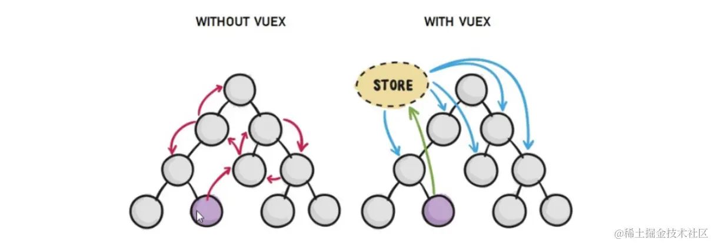

> 什么是状态管理模式？

**状态管理模式**是一种在应用程序中组织和管理状态（数据）的设计模式或架构方案。这种模式的核心思想是将所有组件共有的状态集中存放在一个单独的地方（称为“状态源”或“存储”），并规定了一套明确的方式来操作和更新这些状态，确保状态变化的过程有序可控，避免因多个组件直接相互作用而导致的状态混乱或难以追踪的问题

Vuex 就是一个非常典型的状态管理模式实现。Vuex 提供了一个中心化的 Store，其中包含以下主要部分：

- **State**：集中存储应用的状态，所有组件可以从 Store 中获取或订阅状态
- **Getters**：类似于计算属性，用来从 State 派生出新的状态值，方便组件消费
- **Mutations**：唯一更改 State 的方法，遵循纯函数原则，确保状态变化可预测
- **Actions**：用于处理异步操作，最终通过提交 Mutation 来改变 State
- **Modules**：将 Store 拆分成更小的、独立管理的状态块，增强大型应用的状态管理结构

它们的联动关系如下：

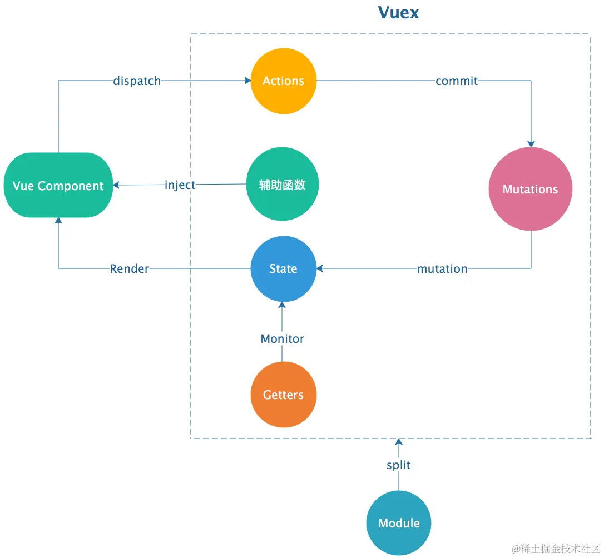

状态管理模式提高了应用的状态可见性、可控性和可测试性，使得大型项目中的状态管理和组件之间的通信更为清晰和易于维护

## 安装与使用

vuex 是一个独立存在的插件，如果脚手架初始化没有选 vuex，就需要额外安装

```bash
npm i vuex@3
```

新建 `store/index.js` 专门存放 vuex。为了维护项目目录的整洁，在 src 目录下新建一个 store 目录，其下放置一个`index.js`文件

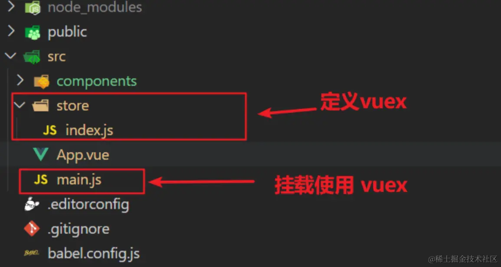

创建仓库 `store/index.js`

```js
import Vue from "vue";
import Vuex from "vuex";
// vuex 也是 vue 的插件, 进行插件的安装初始化
Vue.use(Vuex);

// 创建仓库 store
const store = new Vuex.Store();
// 导出仓库
export default store;
```

在 `main.js` 中导入挂载到 Vue 实例上

```js
import Vue from "vue";
import App from "./App.vue";
import store from "./store";

new Vue({
  render: (h) => h(App),
  store,
}).$mount("#app");
```

## 核心概念

Vuex 的核心概念包括：State（状态）、Mutation（变化）、Action（动作）、Getter（获取器）、Module（模块）

### State

Vuex 使用单一状态树来管理应用的状态，也就是一个包含了所有状态的对象。通过将状态放在一个集中的地方，可以方便地跟踪和管理应用的状态

State 提供**唯一**的**公共数据源**，所有共享的数据都要统一放到 Store 中的 State 中存储。在 state 对象中可以添加我们要共享的数据：

```js
// 创建仓库 store
const store = new Vuex.Store({
  // state 状态, 即数据, 类似于 vue 组件中的 data,
  // 区别在于 data 是组件自己的数据, 而 state 是组件共享的数据
  state: {
    count: 10,
  },
});
```

#### 通过仓库直接访问

组件中可以使用`this.$store`获取到 vuex 中的 store 对象实例，可通过 **state** 属性属性获取 **count**：

```html
<h1>state的数据---{{ $store.state.count }}</h1>
```

也可以将 state 属性定义在计算属性中：

```js
// 把 state 中数据，定义在组件内的计算属性中
computed: {
  count () {
    return this.$store.state.count
  }
}
```

> 使用计算属性简化了代码，但是每次都需要依次提供计算属性，比较繁琐，vuex 辅助函数帮我们解决了这个问题

#### mapState

我们可以使用 `mapState` 辅助函数帮助我们生成计算属性，`mapState` 函数返回的是一个对象

```js
// 在单独构建的版本中辅助函数为 Vuex.mapState
import { mapState } from "vuex";

export default {
  // ...
  computed: mapState({
    // 箭头函数可使代码更简练
    count: (state) => state.count,

    // 传字符串参数 'count' 等同于 `state => state.count`
    countAlias: "count",

    // 为了能够使用 `this` 获取局部状态，必须使用常规函数
    countPlusLocalState(state) {
      return state.count + this.localCount;
    },
  }),
};
```

采用数组形式引入 state 属性

```js
mapState(["count"]);
```

如果想与局部计算属性混合使用，则需要使用**展开运算符**将导出的状态映射给计算属性

```js
computed: {
  localComputed () { /* ... */ },
  ...mapState(['count'])
}
```

### mutations

变化是修改状态的唯一方式。它类似于事件，每个变化都有一个类型和一个处理函数。通过提交一个变化，可以触发状态的修改

事实上确实是可以直接修改 store 中的数据，无需通过 mutation，并且不会报错。**但直接修改可能会造成很严重的后果，** Vue 官方也不希望我们这么做，如若担心自己可能无意间直接修改了 store 中的数据，可以开启严格模式 `strict: true` ，让 Vue 来监督我们：

```js
const store  = new Vuex.Store({
  strict: true
  state: {
    count: 0
  },
  // 定义mutations
  mutations: {
  }
  // ...
})
```

#### 访问 mutations

state 数据的修改只能通过 mutations，并且 mutations 必须是同步的。mutations 是一个对象，对象中存放修改 state 的方法

```js
mutations: {
  // 第一个参数是当前 store 的 state 属性
  // payload 载荷用于运输参数，可以是一个对象
  addCount (state, payload) {
    state.count += payload.amount
  }
}
```

组件中提交 mutations

```jsx
this.$store.commit("addCount", { amount: 10 });
```

也可以使用对象风格的提交方式

```js
this.$store.commit({
  type: "addCount",
  amount: 1,
});
```

#### mapMutations

> mapMutations 和 mapState 很像，它把位于 mutations 中的方法提取了出来

```js
import  { mapMutations } from 'vuex'
methods: {
  ...mapMutations(['addCount']),
   // 或者
  ...mapMutations({
    addCount: 'addCount' // 将 `this.addCount()` 映射为 `this.$store.commit('addCount')`
  })
}
```

此时，就可以直接通过`this.addCount()`调用

```jsx
<button @click="addCount">+1</button>
```

> mutations 中不能写异步代码，如果有异步的 ajax 请求，应该放置在 actions 中

### actions

Action 类似于 mutation，不同在于：

- Action 提交的是 mutation，而不是直接变更状态
- Action 可以包含任意异步操作

```js
actions: {
  // context等同于store，第二个参数为payload
  setAsyncCount (context, payload) {
    setTimeout(() => {
      context.commit('changeCount', payload)
    }, 1000)
  }
},
```

#### 分发 Action

```js
setAsyncCount () {
  this.$store.dispatch('setAsyncCount', 666)
}
```

- `Actions`支持同样的载荷方式和对象方式进行分发

```js
// 以载荷形式分发
store.dispatch("incrementAsync", {
  amount: 10,
});

// 以对象形式分发
store.dispatch({
  type: "incrementAsync",
  amount: 10,
});
```

#### mapActions

```js
import { mapActions } from "vuex";

export default {
  // ...
  methods: {
    ...mapActions([
      "increment", // 将 `this.increment()` 映射为 `this.$store.dispatch('increment')`

      // `mapActions` 也支持载荷：
      "incrementBy", // 将 `this.incrementBy(amount)` 映射为 `this.$store.dispatch('incrementBy', amount)`
    ]),
    ...mapActions({
      add: "increment", // 将 `this.add()` 映射为 `this.$store.dispatch('increment')`
    }),
  },
};
```

直接通过 `this.方法`就可以调用

#### 组合 Action

首先，你需要明白 `store.dispatch` 可以处理被触发的 action 的处理函数返回的 Promise，并且 `store.dispatch` 仍旧返回 Promise：

```js
actions: {
  actionA ({ commit }) {
    return new Promise((resolve, reject) => {
      setTimeout(() => {
        commit('someMutation')
        resolve()
      }, 1000)
    })
  }
}
```

现在你可以：

```js
store.dispatch("actionA").then(() => {
  // ...
});
```

在另外一个 action 中也可以：

```js
actions: {
  // ...
  actionB ({ dispatch, commit }) {
    return dispatch('actionA').then(() => {
      commit('someOtherMutation')
    })
  }
}
```

最后，如果我们利用 [async / await (opens new window)](https://link.juejin.cn/?target=https%3A%2F%2Ftc39.github.io%2Fecmascript-asyncawait%2F)，我们可以如下组合 action：

```js
// 假设 getData() 和 getOtherData() 返回的是 Promise

actions: {
  async actionA ({ commit }) {
    commit('gotData', await getData())
  },
  async actionB ({ dispatch, commit }) {
    await dispatch('actionA') // 等待 actionA 完成
    commit('gotOtherData', await getOtherData())
  }
}
```

> 一个 `store.dispatch` 在不同模块中可以触发多个 action 函数。在这种情况下，只有当所有触发函数完成后，返回的 Promise 才会执行。

### getters

获取器用于从状态中派生出新的状态。它可以将现有的状态进行计算和转换，**并提供一个类似于计算属性的方式来访问这些派生状态**

例如，state 中定义了 list 数组，而在组件中，需要显示所有大于 5 的数据，使用 getters 可以帮助我们实现它：

```js
state: {
  list: [1, 2, 3, 4, 5, 6, 7, 8, 9, 10];
}
getters: {
  // state参数即为模块中的state
  filterList: (state, getters) => state.list.filter((item) => item > 5);
  // getters参数用于访问已注册的getters
  doubleFilterList: (state, getters) =>
    getters.filterList.map((item) => item * 2);
}
```

#### 属性方式访问

原始方式`$store`

```html
<div>{{ $store.getters.filterList }}</div>
```

#### 通过方法访问

```js
getters: {
  // ...
  getTodoById: (state) => (id) => {
    return state.todos.find((todo) => todo.id === id);
  };
}
store.getters.getTodoById(2); // -> { id: 2, text: '...', done: false }
```

> 注意，getter 在通过方法访问时，每次都会去进行调用，而不会缓存结果。

#### mapGetters

Getter 辅助函数与上文类似，均是用于用于获取对象属性值的函数，简化了代码

```js
import { mapGetters } from "vuex";

export default {
  // ...
  computed: {
    // 使用对象展开运算符将 getter 混入 computed 对象中
    ...mapGetters([
      "doneTodosCount",
      "anotherGetter",
      // ...
    ]),
    ...mapGetters({
      // 把 `this.doneCount` 映射为 `this.$store.getters.doneTodosCount`
      doneCount: "doneTodosCount",
    }),
  },
};
```

### modules

#### 概念

Module（模块）: 模块可以将整个状态树分割成更小的模块，每个模块都有自己的状态(state)、变化(mutation)、动作(action) 和获取器(getter)。这样可以将复杂的应用程序拆分成可维护和可测试的模块。通过模块化的方式，可以更好地组织和维护大型的状态管理

> 由于使用单一状态树，应用的所有状态会集中到一个比较大的对象。当应用变得非常复杂时，store 对象就有可能变得相当臃肿，于是就有了 Vuex 的模块化。模块化是使用 Vuex 的一种重要的模式，开发中基本上都是基于模块化思想来开发

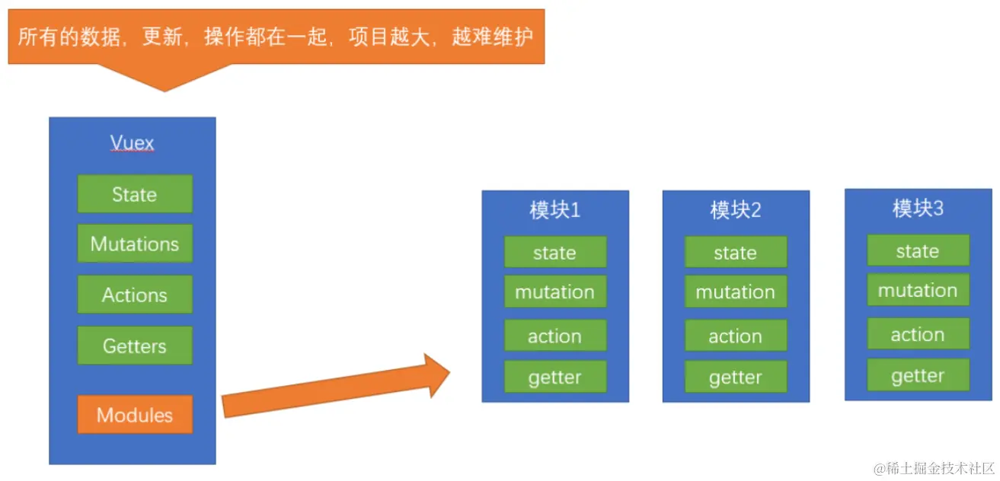

#### 模块化示例

Vuex 允许我们将 store 分割成**模块（module）**。每个模块拥有自己的 state、mutation、action、getter、甚至是嵌套子模块——从上至下进行同样方式的分割：

```jsx
const moduleA = {
  state: () => ({ ... }),
  mutations: { ... },
  actions: { ... },
  getters: { ... }
}

const moduleB = {
  state: () => ({ ... }),
  mutations: { ... },
  actions: { ... }
}

const store = new Vuex.Store({
  modules: {
    a: moduleA,
    b: moduleB
  }
})

store.state.a // -> moduleA 中的 state 对象
store.state.b // -> moduleB 中的 state 对象
```

> 使用模块中的数据, 可以直接通过模块名访问 `$store.state.模块名.xxx`，也可以通过 mapState 映射

#### 模块局部状态

对于模块内部的 mutation 和 getter，接收的第一个参数是**模块的局部状态对象**

```js
const moduleA = {
  state: () => ({
    count: 0,
  }),

  mutations: {
    increment(state) {
      // 这里的 state 对象是模块的局部状态
      state.count++;
    },
  },

  actions: {
    // 局部状态通过 context.state 暴露出来
    // 根节点状态则为 context.rootState
    incrementIfOddOnRootSum({ state, commit, rootState }) {
      if ((state.count + rootState.count) % 2 === 1) {
        commit("increment");
      }
    },
  },

  getters: {
    doubleCount(state) {
      return state.count * 2;
    },
    // 模块内部的 getter，根节点状态会作为第三个参数暴露出来
    sumWithRootCount(state, getters, rootState) {
      return state.count + rootState.count;
    },
  },
};
```

#### 命名空间

默认情况下，模块内部的 action、mutation 和 getter 是注册在**全局命名空间**的——这样使得多个模块能够对同一 mutation 或 action 作出响应

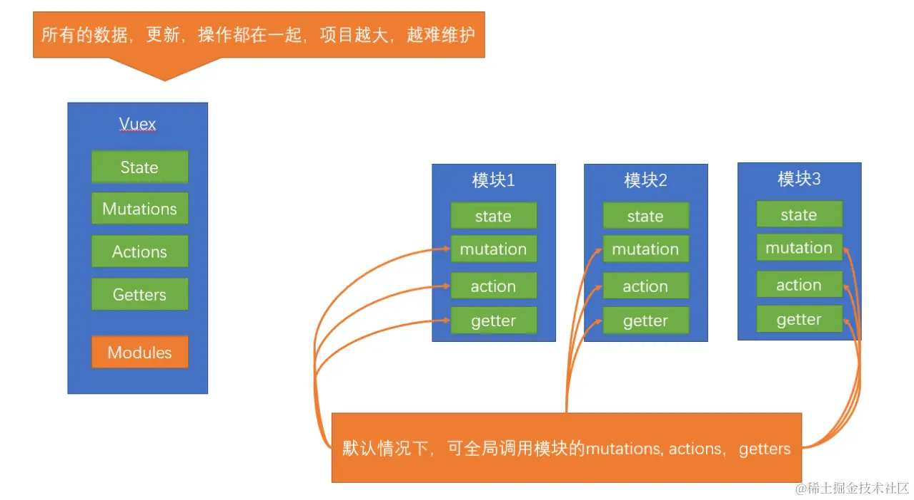

如果希望你的模块具有更高的封装度和复用性，你可以通过添加 `namespaced: true` 的方式使其成为带命名空间的模块。当模块被注册后，它的所有 getter、action 及 mutation 都会自动根据模块注册的路径调整命名。例如：

```js
const store = new Vuex.Store({
  modules: {
    account: {
      namespaced: true,

      // 模块内容（module assets）
      state: () => ({ ... }), // 模块内的状态已经是嵌套的了，使用 `namespaced` 属性不会对其产生影响
      getters: {
        isAdmin () { ... } // -> getters['account/isAdmin']
      },
      actions: {
        login () { ... } // -> dispatch('account/login')
      },
      mutations: {
        login () { ... } // -> commit('account/login')
      },

      // 嵌套模块
      modules: {
        // 继承父模块的命名空间
        myPage: {
          state: () => ({ ... }),
          getters: {
            profile () { ... } // -> getters['account/profile']
          }
        },

        // 进一步嵌套命名空间
        posts: {
          namespaced: true,

          state: () => ({ ... }),
          getters: {
            popular () { ... } // -> getters['account/posts/popular']
          }
        }
      }
    }
  }
})
```

启用了命名空间的 getter 和 action 会收到局部化的 `getter`，`dispatch` 和 `commit`。换言之，你在使用模块内容（module assets）时不需要在同一模块内额外添加空间名前缀。更改 `namespaced` 属性后不需要修改模块内的代码

> 本文参考：
>
> - [Vue2 官网](https://link.juejin.cn/?target=https%3A%2F%2Fv2.cn.vuejs.org%2Fv2%2Fguide%2F)
> - [Vuex 官网](https://link.juejin.cn/?target=https%3A%2F%2Fv3.vuex.vuejs.org%2Fzh%2F)
> - [VueRouter3 官网](https://link.juejin.cn/?target=https%3A%2F%2Fv3.router.vuejs.org%2Fzh%2Finstallation.html)
> - [面试官：你真的了解 v-model 是什么吗？(vue2)](https://link.juejin.cn/?target=https%3A%2F%2Fzhuanlan.zhihu.com%2Fp%2F453112282)
